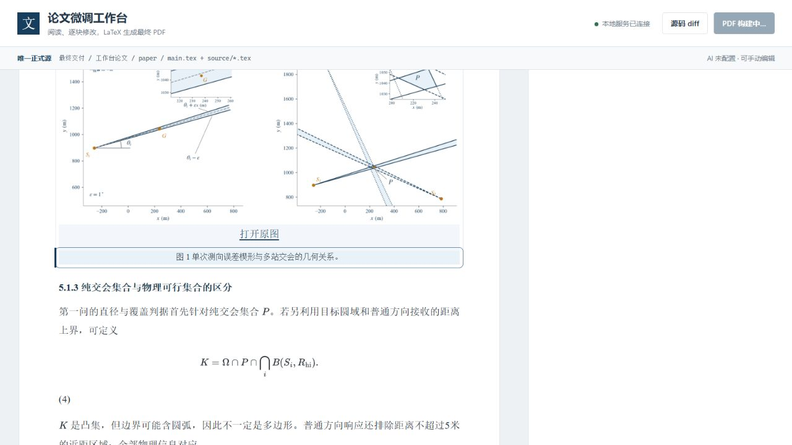

# 实际操作验收

验收日期：2026-09-13。未修改论文数学内容，也未进行视觉复查或反复审计。

- 自动化：`python -m pytest paper_editor/tests paper_editor/test_renderer.py -q`，48 passed in 10.42s。
- 源码映射：463 个稳定块；Q1/Q2 及关联内容共 190 个冻结块。
- 浏览器实际操作：选择 `abstract.p001`，将“组织为”临时改成“表述为”，保存成功，HTML 即时更新，选中块和滚动位置保持；源码 diff 只包含该块。随后通过修改历史撤销，原文完整恢复，基线 diff 为空。
- 图片与图注：点击图片选中只读 `q1.f001`；点击其图注独立定位 `q1.c001`，源码路径为 `paper/source/q1.tex`。图片和原始图册资源均返回 HTTP 200。
- 数学显示：浏览器生成 519 个 MathJax 节点，未检测到 MathJax 错误节点。
- 正式 PDF：界面点击“构建 PDF”，XeLaTeX 两轮成功，引用记录稳定；生成 `paper/build/main.pdf`，101 页，3,278,548 字节。构建快照与当前源一致。原模板保留字体缺字警告（两轮共 80 行），无 Overfull；未为工具验收修改模板或论文内容。
- 一键入口：真实 Windows PowerShell 5.1 执行 `start-paper-editor.ps1 -NoBrowser -Port 8765`，正确识别并复用同目录工作台，无重复服务。
- AI：按用户要求暂未配置。未调用真实远程模型；提案不落盘、冻结差异阻止接受等流程由模拟服务测试覆盖。

## 实际操作截图

截图记录图注选中状态，仅作为操作留档，不用于视觉复查。

## 隔离目录首次安装的限制

从已提交源码创建的隔离目录中，`.venv` 创建成功；依赖安装未通过。原 pip 镜像报告代理超时，指定官方 PyPI 并在子进程绕过代理后仍返回 `No matching distribution found for fastapi==0.136.1`。官方 PyPI 发布元数据确认该版本存在，因此没有擅自更换依赖版本。

启动器已增加一次官方源直连回退，且不修改全局配置；但本机隔离首装没有到达 MathJax 下载与服务启动阶段，不能声称全新机器首装已验收通过。现有环境中的 48 项测试、实际浏览器保存/撤销及正式 PDF 构建结果如上。
