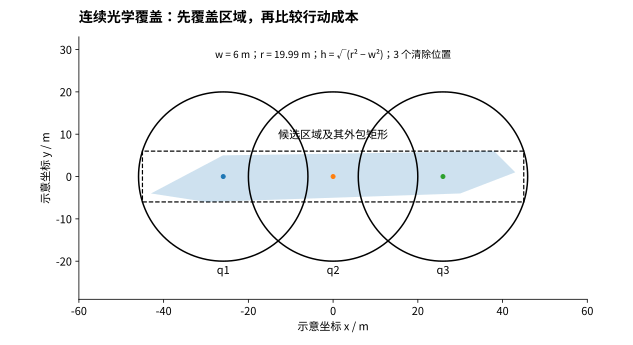
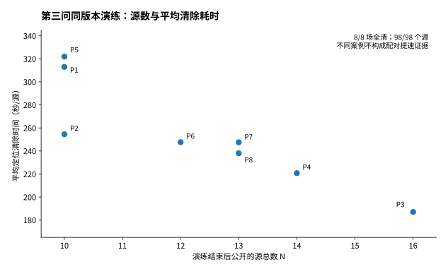
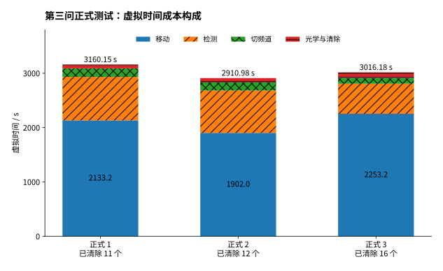

# 问题三：基于覆盖判据与光学终局决策的全向干扰源搜索清除

## 1 模型目标与总体思路

问题三中，机器狗从目标圆域中心出发，需要在干扰源数量、位置、所占频道及有效接收半径均未知的条件下，完成全部全向干扰源的搜索、定位与清除。与前两问针对单个目标的定位分析不同，本问还需决定目标处理顺序，并在任务结束前判断是否存在尚未发现的源。因此，不能仅以定位区域最小或行进距离最短作为唯一目标，而应在可靠完成任务的前提下，综合减少移动、检测、频道切换和光学清除的总时间。

记目标区域为 $\Omega=\{x\in\mathbb R^2:\|x\|\le1800\}$，频道集合为 $\mathcal H=\{1,\ldots,20\}$，源总数满足 $10\le N\le16$，但 $N$ 不作为算法输入。设一次运行的总移动距离为 $L$，检测次数为 $n_m$，测向机频道切换次数为 $n_s$，光学清除失败与成功次数分别为 $n_f$、$n_c$，则总虚拟时间为

$$
T=\frac{L}{5}+5n_m+n_s+3n_f+5n_c. \tag{3-1}
$$

式（3-1）将成功清除的光学定位3秒与激光清除2秒合计为5秒。清除指令中的频道仅指定目标，不改变测向机当前频道，因而不产生切换费用。任意位置均可结束任务，无需返回原点；目标圆域限制的是干扰源分布，而非机器狗的正常活动范围。[^q3rules]

据此，构建“逐频道观测更新—覆盖搜索与路径安排—成本驱动定位清除”的闭环策略，最终实现记为 OpticalTaskP3。算法只使用已经接受的检测、清除响应和当前机器狗状态；预测结果仅参与动作排序，不用于直接判定频道为空或目标已清除。第二问的几何分析用于指导有效交会，但本问以完整任务成本为目标，不直接将第二问的最坏定位直径最优规则等同于本问的时间最优策略。

## 2 观测约束与定位区域更新

### 2.1 正向测量的几何约束

对频道 $h$，记有效示向度记录为 $\mathcal D_h=\{(s_i,\widehat\theta_i)\}$。按照第一问的交会思想，每次有效测向给出以 $s_i$ 为顶点的窄扇形约束 $W(s_i,\widehat\theta_i)$。考虑接口示向度保留两位小数，实施时在题设 $1^\circ$ 误差半宽之外加入 $0.005^\circ$ 量化余量及微小数值保护，取 $\varepsilon_{\mathrm{eff}}=1.0050001^\circ$。

令 $u(\theta)=(\cos\theta,\sin\theta)$，三角函数计算前将角度换为弧度。候选源位置满足

$$
\begin{aligned}
\operatorname{cross}\bigl(u(\widehat\theta_i-\varepsilon_{\mathrm{eff}}),x-s_i\bigr)&\ge0,\\
\operatorname{cross}\bigl(u(\widehat\theta_i+\varepsilon_{\mathrm{eff}}),x-s_i\bigr)&\le0.
\end{aligned}\tag{3-2}
$$

有效接收还给出 $\|x-s_i\|\le1500$。因此，正向观测对应的凸松弛区域为

$$
P_h^{+}=\Omega\cap\bigcap_{(s_i,\widehat\theta_i)\in\mathcal D_h}
\left[W(s_i,\widehat\theta_i)\cap B(s_i,1500)\right]. \tag{3-3}
$$

圆盘采用切向半平面形成的外包多边形近似，并与测向半平面交集运算。普通方向观测隐含的“距离大于5米”约束不直接并入该凸松弛；近距响应则单独处理，不能将这种松弛与包含全部物理条件的精确集合混同。实现不将同一位置的重复读数作为新的独立空间证据。

### 2.2 无信号观测的信息利用

记频道 $h$ 在清除之前的无信号位置集合为 $\mathcal Z_h$。全向源的有效接收半径不小于1000米，故在位置 $z$ 接收到无信号响应时，该频道的未清除源不可能位于 $B(z,1000)$ 内。对已经发现的源，可据此进一步缩小候选区域；对尚未发现的频道，可累计其排除区域。

此外，同一源的有效接收半径在一次测试中不变。若位置 $s$ 收到信号、位置 $z$ 未收到信号，则存在 $R_h$ 使

$$
\|x-s\|\le R_h<\|x-z\|.
$$

将两边平方并整理，得到可用于计算的闭半平面约束

$$
2(z-s)^{\mathsf T}x\le\|z\|^2-\|s\|^2. \tag{3-4}
$$

式（3-4）利用的是同一频道的实际正、负观测关系，不要求预先知道 $R_h$。实现中同时采用接收关系半平面与无信号圆盘排除；非凸差集通过保守凸包继续参与定位，可能保留额外候选位置，但不以估计中心代替整个候选区域。以下将数值实现中维护的凸候选区域记为 $\widetilde P_h$。

当接口返回近距响应 `near` 时，机器狗与该源距离不超过5米，已落在20米光学清除范围内，可直接执行清除，而不再追求新的示向度。几何约束矛盾或数值计算异常时报告异常，不把异常频道标为已经完成。

## 3 逐频道覆盖搜索与路径安排

### 3.1 未发现频道的覆盖判定

对尚未发现的频道 $h$，定义尚不能排除的位置集合

$$
U_h=\Omega\setminus\bigcup_{z\in\mathcal Z_h}B(z,1000). \tag{3-5}
$$

若 $U_h=\varnothing$，则该频道在整个目标区域内均已被无信号观测排除，可以判为空频道。不同频道的检测历史可能不同，因此覆盖状态按频道独立维护，不能将其他频道的无信号记录直接用于本频道。

为实现连续区域上的保守判定，将目标圆域离散为边长60米的方格，并保留所有与目标圆相交的边缘方格。设某格中心为 $c$，若无信号检测位置 $z$ 满足

$$
\|c-z\|+30\sqrt2\le1000-\eta,\qquad \eta>0, \tag{3-6}
$$

则整个方格均处于已排除的接收圆内。式（3-6）不是只检查格点，而是利用格心到格内任意点不超过半对角线的性质覆盖整个单元。

对于后期零散残余区域，再采用“目标圆的外包多边形减去无信号圆的内接多边形并集”形成保守残余集合，结合方格相交判断减少纯整格判据造成的额外搜索。排空结论始终来自已执行观测与覆盖检查；仅在规划中准备访问的地点不产生排空证据。

### 3.2 已知目标与补扫站的联合安排

机器狗首先在原点扫描20个频道，建立已发现目标和未知频道的初始状态。随后，将未清除目标的估计位置作为待访问节点，构造最近邻开放路径，并利用2-opt反转局部路径段以减少路程。由于不要求回到原点，末端不加入返程边。

当未知频道仍有未覆盖区域时，在已知目标访问路径中插入补充扫描站。候选站由多半径环点、内部网格及残余区域中的候选位置构成。设把站点 $s$ 插入相邻节点 $a,b$ 之间所增加的路程为

$$
\Delta L(s)=\|a-s\|+\|s-b\|-\|a-b\|. \tag{3-7}
$$

以新增覆盖单元数 $G(s)$ 与额外时间的比值评价插入收益。对 $G(s)$ 采用不同幂次构造候选路线，再比较包含移动和补扫开销的近似总成本，选取较优路线。每个未知频道一次检测及可能的切换最多计6秒，该上界用于规划估价；实际执行仍按式（3-1）精确累计。

路线形成后，删除不提供独占覆盖的冗余扫描站，并在保持所需覆盖的条件下，将站位向行进路线靠近。到达已有停靠点后，只对能带来足够新覆盖或新交会信息的频道安排检测。算法在完成当前目标或覆盖状态改变后重新安排后续任务，属于基于观测的启发式滚动规划，不宣称得到整个未知场景的最短路径。[^q3base]

## 4 成本驱动的检测点选择与光学清除

### 4.1 单源补测点的有限候选比较

仅有一条示向度时，候选区域通常沿测向方向较长，沿同一射线移动容易保持不利的交会几何。为此，在向目标估计位置接近的同时设置横向偏移，兼顾交会角与行进距离。

正式版本按照首次测点到目标估计位置距离的0.45、0.65、0.85、1.00倍生成前进距离，并组合50、100、200米横向偏移；对每组左右站位先保留当前移动较短的一侧。对新增替代候选，要求其到 $\widetilde P_h$ 全部顶点的距离不超过999.99米。由于欧氏距离是凸函数，该检查同时保证整个凸候选区域位于该站点的1000米接收圆内。原策略动作保留为回退项；该安全筛选仅针对新增替代候选，不将回退动作也无条件视为接收安全。

对满足条件的测点 $s$，用有限步预测成本进行排序，可概括为

$$
\widehat J(s)=\frac{\|s-p\|}{5}+5+
\sum_j w_j\sum_{\ell}q_{\ell}\,
\widehat V\bigl(\widetilde P_h\cap W(s,\theta_{j\ell}),s\bigr). \tag{3-8}
$$

其中，$p$ 为当前位置，$w_j$ 是由候选区域三角形剖分产生的面积权重，$\theta_{j\ell}$ 为假设位置与误差组合形成的未来读数，$\widehat V$ 近似计入后续移动、检测、清除与失败恢复成本。同一目标测点比较中的公共切换费用可省略，真实执行仍完整计费。实施时使用 $-1^\circ,0^\circ,1^\circ$ 三个误差节点及 $0.25,0.50,0.25$ 权重作近似求积；这些是假设情景下的规划权重，不是从官方生成器获知的误差概率。

### 4.2 利用候选区域而非估计点作清除判断

设 $\widetilde P_h$ 的最小包围圆圆心为 $c_h$、半径为 $r_h$。当 $r_h<20$ 时，可在满足 $\|q-c_h\|\le20-r_h$ 的位置 $q$ 执行清除。由三角不等式，对任意 $x\in\widetilde P_h$ 有

$$
\|x-q\|\le\|x-c_h\|+\|c_h-q\|\le20. \tag{3-9}
$$

因此，在候选区域确实包含真实源的条件下，该位置可覆盖整个候选区域。算法将清除点从包围圆圆心向当前位置移动一段允许距离，并保留向内数值余量，从而减少不必要的末端行进。这里使用最小包围圆，而不是直接假定以区域直径为直径的圆一定覆盖区域。

当包围圆尚未缩小到20米以内时，不一律继续测向。基线局部策略对具备至少两条方向记录、包围圆半径不超过80米且尚无失败记录的目标，允许在估计位置进行一次试探清除；这不是成功保证，失败成本与后续恢复成本均须计入。最终策略进一步引入有覆盖依据的有限光学搜索，与原补测或试清除动作进行成本比较。

### 4.3 有限光学覆盖与终局成本比较

对候选区域的最长顶点连线方向及各边方向，分别构造包含 $\widetilde P_h$ 的定向矩形。设矩形沿主轴方向的长度为 $\ell$，法向半宽为 $w$，采用光学保护半径 $r_o=19.99$ 米。当 $w<r_o$ 时，令

$$
h=\sqrt{r_o^2-w^2},\qquad
k=\max\left\{1,\left\lceil\frac{\ell}{2h}\right\rceil\right\}. \tag{3-10}
$$

沿矩形主轴布置 $k$ 个圆心，使各光学圆覆盖的矩形条带连续衔接，即可覆盖整个候选矩形，进而覆盖整个 $\widetilde P_h$。正式版本只考虑 $k\le6$ 的有限计划，并比较正、反两个访问顺序。

设给定假设源位置 $x$ 时，第 $j(x)$ 个光学位置首次清除成功，$q_0=p$，则该假设下的剩余成本为

$$
C(x)=\sum_{i=1}^{j(x)}\frac{\|q_i-q_{i-1}\|}{5}
+3\bigl(j(x)-1\bigr)+5. \tag{3-11}
$$

用候选区域的面积权重估计光学计划成本；只有预计较原动作至少节省1秒时才采用。采样只参与成本排序，连续区域覆盖由矩形与圆盘的几何关系保证。一次失败清除提供对应20米范围内不存在该目标的信息，算法保守更新候选区域并推进至计划下一位置；收到成功响应后才更新清除状态。计划耗尽仍未成功时报告观测或几何矛盾，不以失败响应冒充清除完成。[^q3task]

**图3-1　有限光学覆盖示意。** 所示矩形与多边形用于解释连续覆盖，不是实际场景的源位置或路线。光学圆必须覆盖整个候选区域；采样只用于选择较低成本的访问顺序。

## 5 终止判据与闭环执行

令 $\mathcal K$ 为曾经通过有效方向或近距响应确认有源的频道集合，$\mathcal L$ 为已经成功清除的频道集合，$\mathcal A$ 为经覆盖判定或数量上界判定的空频道集合。集合均按不同频道计数，重复测量不会增加源数。

当所有已知目标均已清除，且其余频道全部具有排空依据，即

$$
\mathcal L\cup\mathcal A=\mathcal H, \tag{3-12}
$$

算法主动结束任务。此外，题目给出 $N\le16$。当 $|\mathcal K|=16$ 时，已经观测到16个不同源，结合数量上界可判定其他频道为空，无须再进行未知频道的空间排查；但这16个源仍须全部清除。当 $|\mathcal L|=16$ 时可以直接结束。只发现或清除10至15个时不能套用该规则，也不能读取测试结束后才公开的真实总数来决定停机。

闭环执行过程为：原点逐频道扫描后更新候选区域与覆盖状态；根据当前已知目标和剩余未知区域安排下一动作；收到完整响应后更新位置、频道、虚拟时间和目标状态；当前目标完成后再规划后续任务；满足式（3-12）或清除数达到公开上界时调用退出指令。有限光学计划执行期间保持计划进度，不随意打断。

程序还以接口返回的实际剩余现实时间设置截止条件，对请求同时检查通信状态和业务接受状态。发生网络超时等重试时复用同一请求标识，避免重复执行；未被接受的响应不推进内部状态。时间耗尽、步数上限和异常退出与满足完成判据的主动退出分别记录，不将前者计为正常完成。

## 6 模型检验与正式测试结果

### 6.1 离线验证与策略权衡

对最终策略开展同场景配对验证。普通场景包含56个均匀生成场景和56个历史参考敏感性场景，另设有效接收半径固定为1000米、1500米并取边界误差的各14个压力场景。最终策略在上述140个非开发场景中均完成全部清除。历史参考模型仅用于敏感性对照，不视为官方真实场景分布。

在均匀模型下，相对未加入最终光学终局决策的上一步策略，场景等权平均每源时间由250.126秒降至248.602秒，下降0.610%；在参考模型下由242.904秒降至240.435秒，下降1.016%。平均收益较小，且部分场景耗时增加，故不据此宣称逐场占优或全局最优。

补充探索还表明，减少移动可能被新增检测成本抵消，缩短最后一次清除后的确认时间也不一定降低整场耗时。因此，策略选型始终考察完整任务成本和正常完成情况，而不是单独追求最少检测、最短路径或最短尾段。未采用候选的完整对照保留为补充材料，不作为正式运行算法的一部分。

### 6.2 官方模拟器演练

正式测试之前，同一最终策略完成8场官方演练。演练结束后模拟器公开源总数，因而可按题意计算被清除比例 $\rho=n_c/N$ 及平均定位清除时间 $\bar T=T/n_c$。结果见表3-1。

表3-1 同版本第三问官方演练结果

| 演练案例编码 | 源总数 | 清除数 | 清除比例 | 平均定位清除时间／秒 |
|:---|---:|---:|---:|---:|
| 2RAG-BYRW-DNT4-8WTY | 10 | 10 | 100% | 313.02 |
| KCJ8-VZB5-8EVB-QNU6 | 10 | 10 | 100% | 254.55 |
| WBHY-JMHS-FE2Q-6CAW | 16 | 16 | 100% | 187.07 |
| X76H-ECV6-TNDX-YVU7 | 14 | 14 | 100% | 220.78 |
| 9U5V-SDSE-WCTP-3BM6 | 10 | 10 | 100% | 321.98 |
| GHZF-RURM-PEB6-YDWN | 12 | 12 | 100% | 247.63 |
| SVSY-F55G-TB4D-63G5 | 13 | 13 | 100% | 247.55 |
| DXPC-XNVZ-ANXK-KJQQ | 13 | 13 | 100% | 238.06 |

8场合计清除98个源，清除比例均为100%，场景等权平均定位清除时间为253.83秒／源。该批演练未包含11源和15源场景，且样本量有限，因此它验证的是所测案例的实际运行效果，而非对任意布局全清的统计证明。不同演练案例之间的耗时差异也不作为算法改进的配对证据。[^q3practice]

源数较少时，未知频道的排空工作可能产生明显的收尾开销。例如，案例KCJ8-VZB5-8EVB-QNU6在最后一个源清除后仍运行398.73秒，以完成其余频道的覆盖确认。该统计是事后计算，算法运行时并不知道真实源数已被清除完毕，不能将这段时间直接删除或以真实总数提前停止。

**图3-2　8场同版本官方演练。** P1—P8按表3-1顺序对应案例。源数由演练结束统计公开；不同场景不构成新旧算法配对比较。

### 6.3 三次正式测试

三次正式运行均采用同一策略源码版本，分别清除11、12、16个源。按题目要求整理正式结果如表3-2所示。

表3-2 第三问正式测试结果

| 正式测试序号 | 清除干扰源个数 | 平均定位清除时间／秒 | 程序运行时间／秒* |
|:---|---:|---:|---:|
| 第1次 | 11 | 287.29 | 1.8464 |
| 第2次 | 12 | 242.58 | 1.5679 |
| 第3次 | 16 | 188.51 | 1.4777 |

*本表以序号匿名展示；官方案例编码未在公开数据中披露。程序运行时间采用驱动器实测时长，不将它写成已核对的模拟器显示时长。最终支撑表需关联原始正式案例编码。*

三次运行的动作统计及虚拟成本分解见表3-3。

表3-3 三次正式测试的动作统计与时间构成

| 指标 | 第1次 | 第2次 | 第3次 |
|:---|---:|---:|---:|
| 总虚拟时间／秒 | 3160.15 | 2910.98 | 3016.18 |
| 移动时间／秒 | 2133.15 | 1901.98 | 2253.18 |
| 检测时间／秒 | 800.00 | 780.00 | 555.00 |
| 频道切换时间／秒 | 157.00 | 151.00 | 107.00 |
| 光学定位及清除时间／秒 | 70.00 | 78.00 | 101.00 |
| 检测次数 | 160 | 156 | 111 |
| 清除尝试次数 | 16 | 18 | 23 |
| 其中失败尝试次数 | 5 | 6 | 7 |

**图3-3　三次正式测试的成本构成。** 柱高是总虚拟时间，不是程序运行时长；各分项按实际动作及响应核算，不由未知源总数反推。

三次合计清除39个源，总虚拟时间为9087.310251秒。按已清除源数量加权的平均定位清除时间为

$$
\bar T_{\mathrm{weighted}}=
\frac{3160.153103+2910.978089+3016.179059}{11+12+16}
=233.01\ \text{秒／源}. \tag{3-13}
$$

分别计算各场 $T/n_c$ 后再等权平均，则为239.46秒／源。两者权重不同，不混用。上述时间均为虚拟任务成本，与表3-2的程序现实运行时间是不同指标。

根据三次成本记录汇总，移动约占总虚拟时间的69.20%，检测占23.49%，频道切换占4.57%，光学定位及清除占2.74%。18次失败清除的直接操作成本共54秒，约占总时间0.59%；这不包含为尝试而发生的移动，不能据此认为失败尝试没有完整成本。结果表明，当前总耗时主要仍由移动与检测构成，评价光学尝试应结合其替代的测向及移动开销。

三次脚本均正常结束，模拟器记录均为程序主动调用退出。前两次依据“已清除频道与覆盖排空频道覆盖全部频道”终止，第三次依据“成功清除数量达到16”终止。正式输出不披露源总数，故前两次不能直接给出由官方真值核验的清除比例；三次共清除39个源也不能写成官方确认的39/39全清。第三次清除16个结合公开数量上界，可以从题设逻辑推出该场已无其他源，但这仍不是官方最终评分。

运行汇总中，脚本与模拟器记录的清除数、虚拟时间、检测次数和失败清除次数一致，行为日志上传已确认且外层校验通过。上传和校验状态不等同于最终评分。[^q3formal] 正式支撑材料应附三次由模拟器导出的原始加密行为日志，并保持原文件名和案例对应关系。

## 7 模型评价

本模型将单源交会定位扩展为多频道、未知源数条件下的完整任务决策。其特点是利用全向源的无信号观测维护逐频道覆盖状态，通过有效接收半径上下界和正负观测关系缩小候选区域，将补扫需求插入目标访问路线，并在定位末段比较继续测向与有限光学搜索的完整成本。停止判据来自真实观测、连续覆盖检查及题目公开的数量上界，不依赖隐藏源数或真实位置。

同版本官方演练中的8场均完成全清，三次正式测试分别清除11、12、16个源并主动结束，表明算法已形成可执行的搜索、定位、清除与结束闭环。其局限在于路径安排和未来动作成本仍采用有限候选及近似预测，计算几何保证依赖相应模型假设与数值实现；已有有限场景结果既不构成全局时间最优证明，也不能将正式阶段的内部完成判断等同于未公开的官方真值评价。

[^q3rules]: 赛题附件2《模拟器通信接口说明及编程指南》，[文本副本](../../../原题/附件/_a2.txt)。
[^q3base]: [第三问基础状态机、定位与覆盖](../../第三问/v10/strategy_v8.py)，以及同目录 strategy_night.py、strategy_transit.py 和 strategy_joint.py。
[^q3task]: [OpticalTaskP3 实现](../../第三问/v10/strategy_task.py)及[最终版本离线验证](../../演练调试/P3_TASK_OPTIMIZATION.md)。本文未将后续未启用的联合规划候选写作正式算法。
[^q3practice]: [同版本8场官方演练](../../演练调试/P3_PRACTICE_0530.md)。
[^q3formal]: [第三问正式结果汇总](../../正式运行/P3_FORMAL_RESULTS.md)及[逐场机器可读数据](../../正式运行/evidence/p3_formal_summary.json)。
