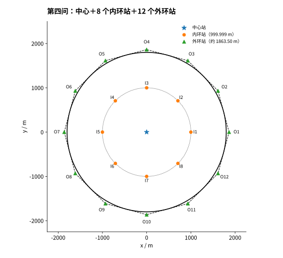
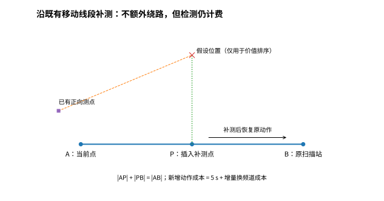
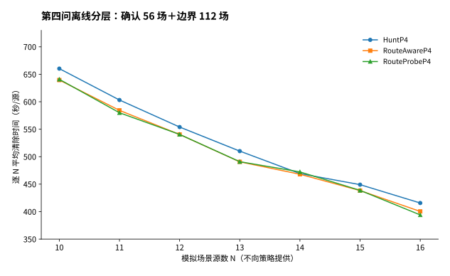
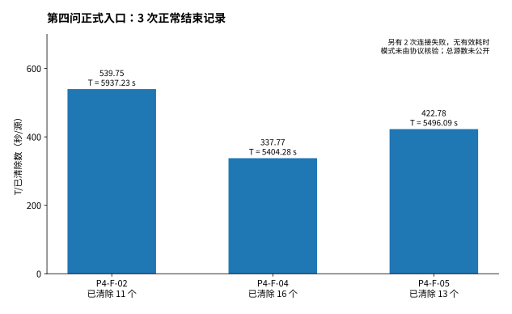

# 问题四：基于连续覆盖验证与零绕路补测的定向干扰源搜索清除

## 1 问题分析与模型目标

问题四将部分干扰源由全向辐射改为覆盖角为180°的定向辐射。检测不到信号既可能是频道不存在，也可能是距离超过有效接收半径，或检测点位于发射半平面之外。因此，第三问中由无信号观测排除1000米圆盘的规则不再成立。本问需要在源位置、接收半径和发射朝向未知的条件下，保留发现全部目标的依据，并减少为寻找第二个有效视点而产生的重复行进。

沿用第三问的目标圆域 $\Omega=B(0,1800)$、频道集合 $\mathcal H=\{1,\ldots,20\}$ 和总数约束 $10\le N\le16$。对定向源 $h$，设位置为 $x_h$，有效接收半径为 $R_h\in[1000,1500]$，朝向单位向量为 $n_h$。检测点 $s$ 能接收到该源信号的条件为

$$
\|s-x_h\|\le R_h,\qquad n_h^{\mathsf T}(s-x_h)\ge0. \tag{4-1}
$$

其中覆盖边界包含在有效范围内；全向源只要求距离条件。在满足接收条件且距离不超过5米时，接口返回近距信息，而非示向度。光学清除仅由20米距离条件决定，与发射朝向无关。[^p4rules]

本问仍以可靠完成任务为前提，减少总虚拟时间

$$
T=\frac{L}{5}+5n_m+n_s+3n_f+5n_c, \tag{4-2}
$$

其中 $L$ 是累计移动距离，$n_m,n_s,n_f,n_c$ 分别为检测、测向机频道切换、失败清除和成功清除次数。本文采用的最终实现为 **RouteProbeP4**：以21站连续覆盖构造作为发现骨架，将可执行的光学清除任务与剩余扫描站联合安排，并在既有行进线段上插入少量有价值的补测。算法不以推断全部源的精确朝向为先决条件，也不读取模拟器隐藏真值。[^p4route][^p4probe]

## 2 朝向未知条件下的发现覆盖

### 2.1 共同近邻凸包条件

若只采用第三问的圆心与少量环上点，定向源可能始终背向检测点。为此，对任意候选源位置 $x\in\Omega$，考虑距离不超过最小接收半径的站点集合

$$
\mathcal S_x=\{s\in\mathcal S:\|s-x\|\le1000\}.
$$

采用下列充分条件保证未知朝向下至少有一个站点可以接收：

$$
x\in\operatorname{conv}(\mathcal S_x),\qquad \forall x\in\Omega. \tag{4-3}
$$

证明如下。对任意朝向 $n$，如果 $\mathcal S_x$ 中所有站点均不在闭覆盖半平面内，则有 $n^{\mathsf T}(s-x)<0$。任意这些站点的凸组合亦满足该严格不等式，与 $x\in\operatorname{conv}(\mathcal S_x)$ 矛盾。因此，至少存在一个站点同时满足距离条件和覆盖角条件。式（4-3）不依赖真实源位置的事先获取，而要求对整个允许区域成立。

### 2.2 21站构造与连续验证

采用一个中心站、8个内环站和12个外环站。内环半径为999.999米，等角间隔45°；外环为正十二边形顶点，其内切圆半径取1800.0001米，因此外环半径为

$$
R_{\mathrm{out}}=\frac{1800.0001}{\cos(\pi/12)}\approx1863.50\ \mathrm m. \tag{4-4}
$$

外环站位于目标圆域外是允许的：题目限制源的位置，不禁止机器狗在圆域外检测。站点布局见图4-1。它不是某场实际机器狗轨迹，也不表示所有站点在每场都会按固定顺序访问。[^p4compact]

**图4-1　中心、内环和外环组成的21站发现骨架。** 实线圆为目标域边界，虚线多边形为外环站凸包。图中的位置由实际实现参数计算，不含任何测试场景的干扰源真值。

覆盖验证不是检查有限采样点。实现以包含目标圆的96边形与站点凸包的交集为验证域，通过有理数闭半平面裁剪维护连续单元。对每个凸单元 $C$，取满足“到 $C$ 的所有顶点均不超过1000米”的共同近邻站点集合 $\mathcal J_C$；再检查

$$
C\subseteq\operatorname{conv}(\mathcal J_C). \tag{4-5}
$$

由于欧氏距离在凸单元上的最大值可由顶点控制，$\mathcal J_C$ 中站点到单元内任意点都满足接收距离条件；式（4-5）于是给出整个单元上的式（4-3）。未能认证的单元继续细分，只有覆盖全部连续验证域后才形成完成证据。距离与外包域均保留数值保护余量，站点坐标与验证参数有对应哈希。本文不将“所有三角剖分边均小于1000米”作为该21站构造的证明。[^p4compact]

### 2.3 计划覆盖与实际排空分离

对每个尚未发现的频道，程序分别保存已经实际执行检测的站点。规划中未来要去的站点可以用于验证一个候选计划是否仍具有完整发现能力，但不能提前用于判定频道为空。完成阶段必须再次使用实际检测位置核验覆盖。

算法允许利用已经到达的清除位置替换或删去未来扫描站，但必须先通过连续覆盖验证；真正结束发现阶段时仍以实际观测为依据。若累计确认了16个不同源频道，可由公开上界判定其他频道为空。当前实现还要求这些已知源已清除或已经具备可执行的清除覆盖计划，才取消剩余发现站，避免把“不再需要找新源”误当成“已知源已经处理完毕”。[^p4route]

## 3 有界定位、光学覆盖与安全恢复

有效示向度仍按误差扇形进行交会，并结合目标圆域及1500米接收上界维护候选区域。误差半宽采用 $1.0050001^\circ$，包括两位小数量化的保护余量。对已有目标遇到的无信号响应，只保留其不可接收事实，不按全向源规则裁剪1000米圆盘，也不把多个无信号点的连线解释成朝向边界。[^p4hunt]

对同一源，实际可接收集合是圆盘与闭半平面的交集，因而是凸集。当已获得至少两个不同的正向观测位置 $s_1,s_2$ 时，在

$$
s(\lambda)=(1-\lambda)s_1+\lambda s_2,\qquad 0\le\lambda\le1 \tag{4-6}
$$

处补测仍满足相同源的接收条件。局部规划器从正向点凸组合中产生新视点，排除重复位置，并结合移动与预期完成成本排序。只有一个正向位置时不能应用这一安全保证；实现允许有限次横向偏移、换侧与回退探测，并明确将其视为可能返回无信号的尝试。局部规划器每频道最多提出8次测量，预算耗尽后返回既有全局搜索或定位恢复逻辑，不跳过该频道，也不伪造完成状态。[^p4local]

候选区域已经被当前位置的20米圆完整覆盖，或返回 `near` 时，可执行原地清除。当候选区域仍较长时，采用最多6个位置的有限光学覆盖计划；构造要求覆盖整个连续区域，不只是估计中心或若干假设点。计划成本包括到达各位置的移动时间、前序失败尝试各3秒及成功清除5秒。估价只决定任务顺序，实际成功仍由响应确认。[^p4hunt]

光学计划执行期间保持剩余位置队列。失败后推进至下一位置，成功后结束该频道；计划耗尽仍未成功则报告观测或几何矛盾，而非无限重复。扫描阶段穿插清除时保留站点与频道游标；同点重复且没有新观测的定位动作也受到无进展检查约束。由此将局部尝试控制在有限范围内，不以扩大清除阈值替代定位验证。[^p4hunt]

## 4 发现站与清除任务的联合路线

在一个站点的当前检测队列完成后，以剩余扫描站和已具备完整光学覆盖方案的目标构成联合任务节点。对目标节点采用其当前估计位置作为路线代理，实际执行时调用对应覆盖计划。

路线求解使用两个初始方案：一是所有任务节点的最近邻开放路径；二是以扫描站路线为骨架，将清除任务按最小新增路程插入。随后分别进行有次数上限的2-opt反转及单节点搬移，选择较短的开放路线。执行一个任务并取得真实响应后，再从实际当前位置重算剩余任务。[^p4route]

这种方法将“扫描到最后，再返回已知源位置清除”改为扫描与清除交错执行。它优化的是有限代理节点上的路线，不是对未知源全场景的全局最优控制；光学计划的多个访问点、后续新观测和接收失败仍会改变实际行进，因此论文只将它称为在线启发式安排。

未来扫描站的删除或替换与路径缩短分开处理：路径交换只能调整顺序，删除站点必须另有连续覆盖证据。默认关闭未经证据替代扫描站的额外原地扫描投入，避免将“当前位置无需再走路”误解为“多测几个频道没有代价”。[^p4route]

## 5 零绕路补测及其成本门槛

联合路线减少了任务间折返，但单条示向记录仍可能要求另行前往第二个测点。最终策略在已经发出的移动段上插入少量补测：设机器狗当前位置为 $A$，原动作目标站为 $B$，选择

$$
P=A+\lambda(B-A),\qquad 0<\lambda<1.
$$

因为 $P$ 在线段内部，插入前后的移动长度满足

$$
\|A-P\|+\|P-B\|-\|A-B\|=0. \tag{4-7}
$$

图4-2展示该机制。每次只为一个仍只有一个不同正向观测位置的已知频道选点，每频道最多插入2次。原动作的频道不作为本段插入对象，以免重复购买已即将发生的测量。[^p4probe]

**图4-2　零额外路程的补测示意。** 假设位置只用于评估潜在交会价值，不是源真值；插入点可能无信号。补测后恢复原扫描动作，而不是在中间点重新规划路线。

零绕路不等于零成本。设插入前测向机频道为 $c$、补测频道为 $h$、原动作频道为 $b$，则相对于原动作的新增成本为

$$
\Delta T=5+\mathbf1(c\ne h)+\mathbf1(h\ne b)-\mathbf1(c\ne b), \tag{4-8}
$$

即一次检测与完整往返频道变化的增量，范围为5至7秒。程序同时检查插入点与原行进线段的一致性，防止补测后偏离原目标引入未计费绕路。

补测价值按有限假设估计。沿首次示向方向取500、1000、1400米三个假设位置，剔除目标圆外位置；使用若干固定线段比例及假设点在行进段上的投影作为候选。对每个假设计算新旧测距与交会几何，以下近似量仅用于排序：

$$
\widehat r(P)=\tan(\varepsilon_{\mathrm{eff}})
\frac{d_1+d_2}{|\sin\gamma|}. \tag{4-9}
$$

其中 $\gamma$ 是假设位置处的交会角。有效假设还需满足几何与测距筛选，预计节省必须超过 $\max(10,2\Delta T)$ 秒才允许插入。该估计不保证定向源在 $P$ 可接收，也不是候选区域半径证书。只有实际得到正向或近距响应后，才由原几何更新器处理；若返回无信号则消耗已记录的测量成本，并恢复原扫描动作。[^p4probe]

完整执行次序为：处理未结束的光学计划；完成已插入补测并恢复原动作；推进当前扫描频道队列；在任务边界更新路线与覆盖计划；取得响应后更新状态；全部已知源清除且未知频道有排空依据时退出。近距响应可先原地清除，但仍需恢复被暂存的原扫描动作。

## 6 验证结果与成本分析

### 6.1 同场景离线比较

最终版本对应的离线证据包括56场独立确认和112场固定接收半径边界场景。各场景按已知于模拟器、未知于策略的 $N$ 计算 $T/N$，然后等权平均。开发集只用于开发，历史 Cost、Finish 等探索不并入本表；边界场景是压力测试，不等同于官方场景分布。[^p4results]

**表4-1　最终版本分阶段离线比较（平均 $T/N$，秒／源）**

|集合|场数／策略|HuntP4|RouteAwareP4|RouteProbeP4|RouteProbe 全清／正常停止|
|---|---:|---:|---:|---:|---:|
|独立确认|56|512.25|499.32|498.60|56/56 · 56/56|
|固定半径边界|112|528.49|513.53|512.94|112/112 · 112/112|
|上述测试集合计|168|523.08|508.79|508.16|168/168 · 168/168|

在该168场测试集合上，最终候选相对 HuntP4 的平均每源时间下降约2.85%；该比例仅描述上述测试集合上的平均变化。独立确认集单列下降约2.66%。RouteProbeP4 相对 RouteAwareP4 的合计均值差仅0.63秒／源，说明本轮大部分平均收益来自路线联合安排，零绕路补测只带来进一步的小幅收益。不同 $N$ 的结果见图4-3。[^p4results]

**图4-3　同场景离线比较的逐 $N$ 平均时间。** 每个 $N$ 的数据包括确认与边界场景，完整分层口径见表4-1；横轴不是策略可读取的真实源数。最终候选在 $N=14$ 的均值略高于 HuntP4，因此不能只报告总体改善。

相对 HuntP4，最终候选在168场中有51场耗时增加，最差单场增加18.26%。其 $T/N$ 的经验P95为690.35秒／源，HuntP4 为689.98秒／源，尾部并未随均值同步改善。因此，当前证据支持的是有限测试集上的平均成本下降，而不是每场优越性或稳健最优性。[^p4results]

**表4-2　168场测试的每场平均成本（秒）**

|策略|移动|切频道|检测|光学定位及清除|
|---|---:|---:|---:|---:|
|HuntP4|4995.50|258.51|1305.21|79.82|
|RouteAwareP4|4805.68|244.81|1330.18|79.05|
|RouteProbeP4|4780.10|254.02|1336.46|79.57|

最终候选平均减少移动约215.40秒，同时增加检测31.25秒；考虑切频道和清除变化，平均总时间净减约188.89秒。各分项来自公开表格的四舍五入值，分项和与公布总时间可有末位差异。全部168场共发出1388次零绕路补测，809次取得方向，579次无信号，1388次均恢复原扫描动作；无信号补测的成本没有被删除。[^p4results]

### 6.2 当前版本官方演练

当前 RouteProbeP4 具有3场题号与结束统计一致的第四问演练记录，均正常停止并由结束后公开的总源数确认全清。其他版本演练只保留为历史记录，不与当前版本混算；另有一次历史第四问入口误接入第三问的失败记录，也不计入第四问性能。[^p4results]

**表4-3　当前版本官方演练结果**

|匿名运行|清除数／公开总源数|总时间／秒|平均清除时间／秒|检测次数|失败清除次数|
|---|---:|---:|---:|---:|---:|
|P4-P-22|15/15|7074.18|471.61|258|3|
|P4-P-23|16/16|6710.91|419.43|260|6|
|P4-P-24|14/14|5823.89|415.99|227|6|

三场合计45个源均被清除，但样本不足以证明任意定向布局均可在时间限制内完成；其均值亦不能与不同案例的旧版演练均值直接作因果提速比较。

### 6.3 正式入口运行记录

公开汇总保存5次正式入口接入尝试，其中3次正常结束，2次在进入接口时连接被重置而没有结果文件。题号及正式模式由操作人员选择，当前公开记录没有协议核验的模式标志，也没有总源数。因此本节报告实际清除数和 $T/n_c$，不将其改写为官方核验的全清率。匿名编号只是记录索引，不代表额外消耗的正式测试次数。[^p4results]

**表4-4　正式入口记录与缺失结果**

|记录|状态|已清除数|总时间／秒|$T/n_c$／秒|检测次数|失败清除次数|
|---|---|---:|---:|---:|---:|---:|
|P4-F-01|进入连接失败，无结果|—|—|—|—|—|
|P4-F-02|正常结束|11|5937.23|539.75|283|2|
|P4-F-03|进入连接失败，无结果|—|—|—|—|—|
|P4-F-04|正常结束|16|5404.28|337.77|178|6|
|P4-F-05|正常结束|13|5496.09|422.78|220|8|

**图4-4　3次正常结束记录的 $T/n_c$。** 两次连接失败没有可用耗时，表4-4保留其状态，图中不将缺失值绘为0。总源数未公开，横轴标注的是已清除数，不是已知的真实 $N$。

三次正常结束合计清除40个源，按公开舍入值合计虚拟时间约16837.60秒，按清除数加权约420.94秒／源。这里只是完成记录的时间汇总，既不是5次接入尝试的成功率，也不是已获官方确认的40/40全清。三场未知真实源数、不同布局和朝向等因素均可能造成时间差异；不能仅凭中间一场清除16个时的较低 $T/n_c$ 判定算法逐场改善。

## 7 模型评价

本问通过共同近邻凸包条件处理未知朝向下的发现覆盖，以实际观测位置而非规划游标作为排空依据；通过正向点凸组合、有预算的局部探测和完整区域光学覆盖处理定位；通过扫描与清除任务联合安排和零绕路补测减少额外行进。路线交换、站点删除和信息价值估计承担不同职责，不能互相替代证明。

现有证据表明，最终版本在168场离线确认及边界测试中均全清且正常停止，3场当前版本官方演练亦全清；正式入口有3次正常结束记录。其局限在于信息价值和任务节点位置仍为近似，部分补测会无信号，51场离线耗时退步且尾部指标未同步改善。模型保证应限定在相应覆盖条件和计算实现范围内，有限测试结果不构成整个问题的最优性证明。

[^p4rules]: 赛题附件2《模拟器通信接口说明及编程指南》，[文本副本](../../../原题/附件/_a2.txt)，第1—4节。
[^p4compact]: [discovery_compact.py](../../第四问/v6/discovery_compact.py)：21站参数、共同近邻凸包证书与连续验证器入口。
[^p4hunt]: [strategy_hunt.py](../../第四问/v6/strategy_hunt.py)：观测记录、有限光学覆盖、状态保持与实际发现证据。
[^p4local]: [local_hunt.py](../../第四问/v6/local_hunt.py)：有界首对探测和正向点凸组合补测。
[^p4route]: [strategy_route.py](../../第四问/v6/strategy_route.py)：RouteAwareP4 的联合路线、站点替代与完成判据。
[^p4probe]: [strategy_route_probe.py](../../第四问/v6/strategy_route_probe.py)：RouteProbeP4 的零绕路补测、增量计费与原动作恢复。
[^p4results]: [第四问最新结果汇总](../../结果汇总/第四问.md)及同目录[机器可读结果](../../结果汇总/第四问.json)。本文锁定来源提交见本目录 README；统计图使用公开表格舍入值。
