# 有界测向误差下的交会定位与第二检测点极小极大选择

## 摘要

针对题目给定的示向度误差区间，本文分别解决交会定位区域的直径计算与第二检测点选择。第一问将每次测向表示为两个半平面，先判别交集是否为空或无界，再枚举有效边界交点并计算最远顶点对。证明多边形的连续直径等于顶点对最大距离，给出直径圆覆盖的充要条件，并以实际可由测向约束构成的等边三角形说明覆盖一般不成立。第二问以“保证下一次能够接收信号，并使两次观测后精确位置集合的最坏直径最小”为准则，利用首次已收到信号产生的接收半径条件信息，严格推导四圆交集的通用候选区。通过一对不可区分源构造全域下界，将最优站位归结为二次方程的小根；再以解析局部论证和覆盖全部剩余示向度的整数区间证书给出相等上界。未截断首次扇形的两个连续全局最优点为相对首次示向度坐标下的 $(843.034754,\pm545.528422)$ 米，最坏直径为 $110.969319$ 米。平移与旋转该规则，对所有有效首次观测保持同一保证，并达到全部首次观测上的策略级极小极大下界。代码采用常数时间解析选点，并给出完整几何测试、可执行证明证书及同场景配对实验。

关键词：交会定位；有界误差；最小包围圆；极小极大策略；连续全局最优；计算机辅助证明

## 1 问题定义与符号

原题第一问要求的是示向度交会产生的多边形及其直径；第二问要求的是下一检测点的选择策略和候选区域[1]。本文不把源所在的目标圆域误当作机器狗的活动边界，也不通过同点重复测量人为制造独立误差。

记 $\Omega=\{g\in\mathbb R^2:\|g\|\le1800\}$，误差半宽为 $\varepsilon=1^\circ$；近距无法获得示向度的阈值为 $a=5$ 米，接收半径下、上界分别为 $R=1000$ 米、$b=1500$ 米。光学定位范围为20米，与5米近距阈值不是同一个量。以下推导中的角度参与三角函数时均按弧度计算，$u(\alpha)=(\cos\alpha,\sin\alpha)$。

| 符号 | 定义 |
|:---|:---|
| $S_i,\widehat\theta_i$ | 第 $i$ 个检测点及实际读数 |
| $P$ | 仅由示向度形成的半平面交集 |
| $F_1,F_2$ | 利用全部已知物理信息后的精确源位置集合 |
| $D(P)$ | 区域直径；非闭集合采用距离上确界 |
| $R_{\text{*}}(P)$ | 最小包围圆半径 |
| $\mathcal C$ | 对全部候选源保证接收或近距返回的站位集合 |
| $J(S)$ | 给定第二站位时，最终位置集合的最坏直径 |
| $D_{\text{*}}$ | 本文策略的精确极小极大值 |

数学保证只使用误差有界，不要求误差服从均匀分布。实验中的均匀误差是另行声明的场景生成假设，不能作为定理的隐含前提。

## 2 第一问：多边形直径与直径圆覆盖

### 2.1 半平面模型及状态判别

第 $i$ 次方向观测允许的扇形为

$$
W_i=\{g:\ |\operatorname{wrap}(\arg(g-S_i)-\widehat\theta_i)|\le\varepsilon\}.
$$

扇形顶点按闭包包含。令 $u_i^{\text{-}}=u(\widehat\theta_i-\varepsilon)$、$u_i^{\text{+}}=u(\widehat\theta_i+\varepsilon)$。因为 $2\varepsilon<180^\circ$，以下两个叉积条件恰好刻画该有向扇形，而不是整条无向直线的角带：

$$
\operatorname{cross}(u_i^{\text{-}},g-S_i)\ge0,\qquad
\operatorname{cross}(u_i^{\text{+}},g-S_i)\le0. \tag{1}
$$

于是 $P=\bigcap_iW_i=\{g:Ag\le d\}$。不能先套一个任意大方框再声称得到有限直径：当所有测向近乎同向时，原交集可能确实无界。

**命题1（空集、有界与无界）。** 先求解线性可行性问题 $Ag\le d$。非空时，$P$ 有界当且仅当衰退锥 $\{v:Av\le0\}$ 仅含零向量。将各非零法向的极角排序，含首尾环接的最大角隙记为 $\Delta$，则该判据等价于 $\Delta<\pi$。

**证明。** 若有非零 $v$ 满足 $Av\le0$，任取 $g_0\in P$，均有 $g_0+tv\in P$，$t\ge0$，故无界。反之，若 $P$ 无界，取 $\|g_k-g_0\|\to\infty$，将方向归一化并选取收敛子列，极限单位向量 $v$ 满足 $Av\le0$。最后，存在这样的非零 $v$，等价于所有法向都落在一个闭半圆中，也等价于排序后存在至少 $\pi$ 的环接角隙。证毕。

对于非空有界情形，枚举两条不平行边界线的交点，保留满足全部不等式的点，去除重复点并求凸包。每个顶点至少有两条线性独立的活动约束，因此所有顶点均被枚举到；被保留的交点都在 $P$ 中，因此其凸包不会引入区域外点。对于点或线段，仍保留其真实退化状态，不将“顶点少于3个”误记为空集。

### 2.2 连续直径的精确算法

**命题2（最远顶点对定理）。** 对顶点为 $v_1,\ldots,v_m$ 的非空有界凸多边形，

$$
D(P)=\max_{p,q\in P}\|p-q\|=\max_{i,j}\|v_i-v_j\|. \tag{2}
$$

**证明。** 任取 $p=\sum_i\lambda_iv_i$、$q=\sum_j\mu_jv_j$，其中系数非负且各自和为1。利用三角不等式，

$$
\|p-q\|=\left\|\sum_{i,j}\lambda_i\mu_j(v_i-v_j)\right\|
\le\sum_{i,j}\lambda_i\mu_j\|v_i-v_j\|
\le\max_{i,j}\|v_i-v_j\|.
$$

最远顶点对本身属于 $P$，所以反向不等式也成立。证毕。这是对整个连续区域的证明，不是采样精度结论。

主算法先构造 $h=2n$ 个半平面，再枚举 $O(h^2)$ 个交点并逐一检查 $h$ 条约束，构造部分为 $O(h^3)$。少量顶点直接用 $O(m^2)$ 顶点对扫描，避免复杂实现带来的退化错误；顶点较多时使用旋转卡壳。凸多边形的支撑点随支撑方向旋转按边界单调前进，最远点对必是一对对踵支撑点，因此旋转卡壳在 $O(m)$ 次推进内遍历所需点对。平行支撑边时，同时检查两个端点，避免漏掉等距情形。代码将卡壳结果与全点对距离独立比对。

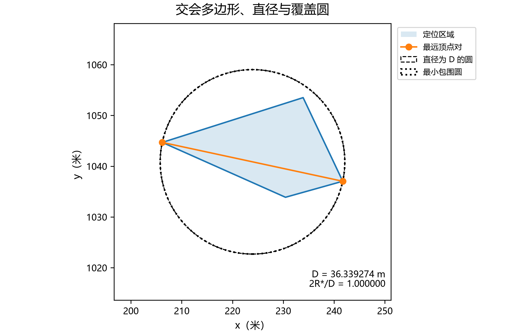{width=11cm}

### 2.3 直径为 $D$ 的圆能否覆盖

**命题3（充要条件）。** 设 $A,B$ 是任意一对直径端点，$M=(A+B)/2$。存在直径恰为 $D(P)$ 的圆覆盖 $P$，当且仅当

$$
\max_i\|v_i-M\|\le\frac{D(P)}2. \tag{3}
$$

它也等价于 $R_{\text{*}}(P)=D(P)/2$。

**证明。** 任何覆盖圆都必须包含距离为 $D$ 的 $A,B$，所以半径至少为 $D/2$。若半径恰为 $D/2$，以圆心 $C$ 写出

$$
\|A-C\|^2+\|B-C\|^2=2\|C-M\|^2+\frac{D^2}{2}.
$$

左侧不超过 $D^2/2$，故 $C=M$。因此圆心没有另外的优化自由度，检查该圆即可。圆盘是凸集，包含全部顶点当且仅当包含其凸包。最小包围圆半径的等价性随即成立。证毕。

空集不报告“完美定位”；无界区域没有有限覆盖圆；单点的 $D=0$，零半径圆覆盖；线段由其中点圆覆盖。以上情形都在接口中分开输出。

**命题4（Jung界及反例）。** 对直径 $D>0$ 的平面有界集合，

$$
\frac D2\le R_{\text{*}}\le\frac D{\sqrt3},\qquad
1\le\frac{2R_{\text{*}}}{D}\le\frac2{\sqrt3}. \tag{4}
$$

**证明。** 下界已由直径端点证明。对于多边形的最小包围圆，圆心必须位于接触顶点的凸包内；否则存在将圆心向所有接触点靠近的方向，小幅移动就会减少最大距离，与最优性矛盾。二维凸包可用一个三角形或一条线段包含圆心。若两接触点支撑该圆，它们相对圆心互为反向，$D=2R_{\text{*}}$。否则取三个支撑点，其圆心角均不大于 $180^\circ$，且和为 $360^\circ$，至少一个圆心角不小于 $120^\circ$。相应弦长至少为 $2R_{\text{*}}\sin60^\circ=\sqrt3R_{\text{*}}$，故 $D\ge\sqrt3R_{\text{*}}$。一般紧集可用有限点逼近并取极限，或直接使用相同支撑论证。证毕。式(4)即平面Jung界[2]。

等边三角形边长为 $D$ 时，最小包围圆半径为 $D/\sqrt3>D/2$，所以答案一般为“不能”。交付算例用三次有效测向生成边长30米的等边三角形，$R_{\text{*}}=10\sqrt3$ 米，$2R_{\text{*}}/D=2/\sqrt3$。以某条边为直径的圆对第三顶点的径向超出量为 $15\sqrt3-15\approx10.980762$ 米。这里的15.47%是最小包围圆**直径**相对 $D$ 的增幅，不是该顶点超出量。

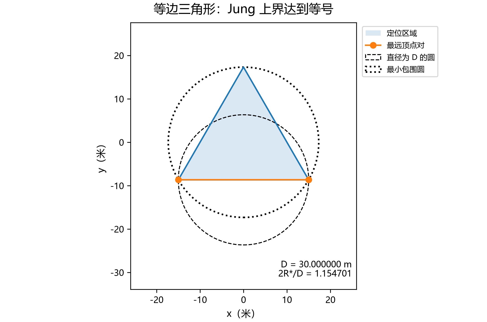{width=10.6cm}

另一个仅使用两次测向的有效反例为 $S_1=(0,0)$、$\widehat\theta_1=0^\circ$，$S_2=(10,-400)$、$\widehat\theta_2=91^\circ$。交集顶点为 $(0,0)$、$(10,\pm10\tan1^\circ)$，其 $2R_{\text{*}}/D=\sec1^\circ>1$。因此不能以检测点数量为理由断言两次测向的直径圆必然覆盖。

### 2.4 先验圆域、近距排除与数值夹逼

原题的纯交会多边形 $P$ 与加入物理先验后的集合不可混称。对普通方向观测，精确物理集合为

$$
F=\Omega\cap\bigcap_i\{g: a<\|g-S_i\|\le b\}\cap P. \tag{5}
$$

它可能含圆弧或近距孔洞，不一定凸。记删去近距下界后的凸集合为 $K$。代码计算 $K$ 或 $F$ 时分别标明含义，未以“多边形近似”冒充原始精确集合。

圆盘的外切正 $N$ 边形包含原圆，内接正 $N$ 边形包含于原圆，外切径向超出为 $r(\sec(\pi/N)-1)$。以外近似保留圆约束、以内近似删除近距圆，得到 $F_N^{\mathrm{out}}\supseteq F$；相反组合得到 $F_N^{\mathrm{in}}\subseteq F$。因此

$$
D(F_N^{\mathrm{in}})\le D(F)\le D(F_N^{\mathrm{out}}). \tag{6}
$$

若内近似为空，只能将0作为平凡下界，不能宣布精确集合为空。非凸集合与其凸包的直径相同，证明与命题2的凸组合论证相同，因此可以对所有保留分量的顶点统一求凸包再计算直径。单个圆的径向误差不直接等于多约束交集的直径误差，正式数值报告采用式(6)夹逼。

## 3 第二问：信息集、精确目标与候选区

### 3.1 只使用首次观测可获得的信息

设已收到普通方向读数 $(S_1,\widehat\theta_1)$。首次精确不确定集合为

$$
F_1=\Omega\cap\{S_1+r u(\widehat\theta_1+\alpha):a<r\le b,\ |\alpha|\le\varepsilon\}. \tag{7}
$$

真实源 $G$、$\|G-S_1\|$ 和真实接收半径均未知，不能作为选点函数的输入。首次已收到信号意味着，对每个假设源 $g\in F_1$，与观测一致的真实接收半径必须满足

$$
R_{\mathrm{true}}\in[\max\{R,\|g-S_1\|\},b]. \tag{8}
$$

故保证第二次接收或近距返回的**完整**条件为

$$
\|S_2-g\|\le\max\{R,\|g-S_1\|\}\quad(\forall g\in F_1). \tag{9}
$$

这不同于错误地对全部源要求 $\|S_2-g\|\le1000$ 米。对于任意具体首次观测，式(9)给出的圆盘交集就是完整可行域；目标边界截断会改变该交集。

本文选择先保证式(9)，再最小化两次观测后的最坏位置集合直径。对普通第二读数 $\phi$，

$$
F_2(S,\phi)=F_1\cap\{g:a<\|g-S\|\le b\}\cap W(S,\phi,\varepsilon),
\quad J(S)=\underset{\phi\ \text{可发生}}{\text{sup}}D(F_2(S,\phi)). \tag{10}
$$

近距返回后可直接光学定位，代价记为0。对于满足式(9)的站位，第二次上界 $\|g-S\|\le b$ 对所有 $g\in F_1$ 自动成立。式(10)优化的是精确物理位置集合，而非线性化误差椭圆、平均误差或另外设定的保守代价。

第二问未规定移动时间与定位精度的加权系数，故本节不声称同时最小化移动时间。这里的“全局最优”均对应已明示的接收保证与最坏直径准则。

### 3.2 标准扇形与四圆交集

平移至 $S_1=0$ 并旋转至 $\widehat\theta_1=0$。先研究未被 $\Omega$ 截断的扇形

$$
F^0=\{r u(\alpha):a<r\le b,\ |\alpha|\le\varepsilon\}.
$$

它包含任意有效首次观测在相对坐标下的 $F_1$，并在原点观测时与真实 $F_1$ 相同。令 $u_{\text{±}}=u(\pm\varepsilon)$。

**命题5（完整四圆候选区）。** 对 $F^0$，条件(9)必要且充分等价于

$$
\mathcal C^0=
B(a u_{\text{-}},R)\cap B(a u_{\text{+}},R)\cap B(Ru_{\text{-}},R)\cap B(Ru_{\text{+}},R). \tag{11}
$$

**证明。** 固定方向 $u$。当 $a\le r\le R$ 时，$\|S-ru\|^2$ 关于 $r$ 是凸二次函数，其区间最大值出现在 $a$ 或 $R$。当 $R\le r\le b$ 时，接收条件为 $\|S\|^2-2rS\cdot u\le0$。在 $r=R$ 满足该式，便有 $S\cdot u\ge0$，且左侧随 $r$ 不增，所以仍只需检查 $R$。角度方面，两个 $Ru_{\text{±}}$ 圆约束保证端点投影非负，因而站位相对扇形轴的偏角落在 $[-\pi/2+\varepsilon,\pi/2-\varepsilon]$。在全部允许角度上，$S\cdot u(\alpha)$ 的最小值出现在两端；等价地，各端点距离的最大值也在两端。因此四个圆约束充分。必要性取 $r=R,\alpha=\pm\varepsilon$，并令 $r\downarrow a$ 即得。近距边界 $r=a$ 虽不产生普通方向读数，但它是有效候选源的极限，所以不能删去相应约束。证毕。

该域不是 $\Omega$，也不要求 $\|S\|\le1000$。由任何一个近端圆可知 $\|S\|\le R+a=1005$，这个1005米界是推导结果，不是人为截断。对被目标边界截断的观测，式(11)仍提供安全的通用候选区；其完整可行域仍由式(9)给出，可能更大。

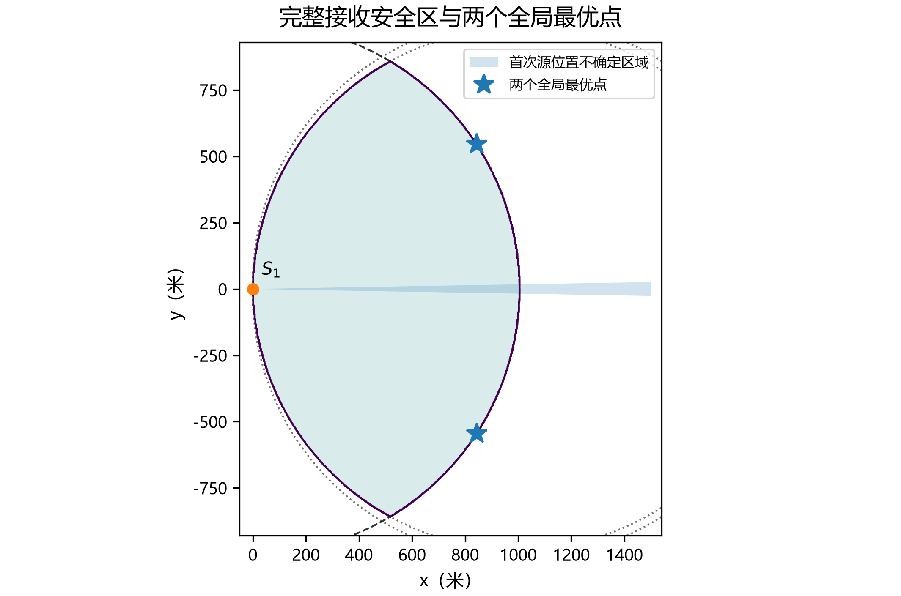{width=11cm}

### 3.3 不可区分源对刻画

对 $S\ne S_1$，两个候选源 $p,q$ 都距 $S$ 超过5米时，能够产生同一个第二示向度，当且仅当两条向量 $p-S,q-S$ 的小夹角不超过 $2\varepsilon$。必要性由两次误差区间重叠得到；充分性取两方向短弧的中点作为读数，各自误差就不超过 $\varepsilon$。在式(9)下，这两个假设都可选择一个与两次接收一致的 $R_{\mathrm{true}}\le b$。因此

$$
J(S)=\text{sup}\{\|p-q\|:p,q\in F^0,\ \|p-S\|,\|q-S\|>a,
\ \angle(p-S,q-S)\le2\varepsilon\}. \tag{12}
$$

式(12)是对式(10)先取区域内点对、再交换两个上确界所得，没有增加或减少物理信息。同点重复测量的误差固定，不能套用两个自由误差；$S=S_1$ 单独按“没有新增信息”处理，它显然不是下面的最优点。

## 4 第二问的连续全局最优证明

### 4.1 一个统一的全域下界

以下再把坐标旋转 $+\varepsilon$，使首次扇形下边界成为横轴，上边界角为 $\delta=2\varepsilon=2^\circ$。记第二站位为 $(X,Y)$，并写 $s=\sin\delta$、$c=\cos\delta$、$s_2=\sin2\delta$、$c_2=\cos2\delta$。由于问题关于首次扇形轴对称，只需研究轴上方一半；另一半最后镜像恢复。

若站位位于首次扇形内部，取经过该站位的径向射线。设它到原点的距离为 $\rho\le1005$。该射线上，避开源近距区和站位近距区后，至少有一段同向不可区分源区间长度达到

$$
\max\{(\rho-10)_{\text{+}},1495-\rho\}\ge742.5. \tag{13}
$$

这些源在第二站看来方向完全相同。于是扇形内部站位的最坏直径至少742.5米，不可能达到后面约111米的最优值。

现在考虑扇形上方的站位 $Y>X\tan\delta$。取远端下边界源 $p=(b,0)$，将向量 $p-S$ 顺时针旋转 $\delta$，与首次上边界射线相交于 $q=t(S)(c,s)$。解两条直线得

$$
t(S)=\frac{N(S)}{H(S)},\quad
N=(bX-X^2-Y^2)s+bYc,\quad
H=(b-X)s_2+Yc_2. \tag{14}
$$

该交点位于第二站的正向射线上：相应射线系数为 $(Yc-Xs)/H>0$。而 $H>0$，因为 $X\le1005<b$、$Y\ge0$。由四圆中远端下圆得到 $X^2+Y^2\le2000X$；由选择轴上方一半得到 $Y\ge X\tan(\delta/2)$，故

$$
N\ge Xs\left(-500+\frac{1500c}{1+c}\right)>0,
$$

非零站位下 $t(S)>0$。这说明式(14)不是把无向直线交点误当成可发生的示向度。

当 $q$ 属于首次有效扇形且距 $S$ 超过5米时，$p,q$ 是夹角恰为 $\delta$ 的有效不可区分源对，其距离为

$$
d(t)=\sqrt{b^2+t^2-2btc}. \tag{15}
$$

下面利用下节证明的 $t\le t_{\text{*}}<b$ 处理两种近端例外。若 $t\le a$，改取 $m=(p+q)/2$。它属于有效首次扇形，$\|p-m\|\ge747.5$ 米。若 $t>a$ 但 $\|q-S\|\le5$，同样取 $m$，有 $\|p-m\|\ge(495-5)/2=245$ 米。两种情况下，$p,m$ 仍落在同一个宽度 $\delta$ 的正向角锥中；且 $\|m-S\|\ge\|p-S\|/2\ge247.5$ 米，所以没有近距测向问题。这些例外只会给出更大的下界，不会破坏后面的结论。

### 4.2 由圆盘极值导出二次方程

任何上半区可行站位都在圆盘 $B((a,0),R)$ 内。对任意标量 $t$，将 $N(S)-tH(S)$ 配方，得到一个严格凹二次函数：

$$
N-tH=-s(X^2+Y^2)+(bs+t s_2)X+(bc-t c_2)Y-tb s_2. \tag{16}
$$

定义

$$
A(t)=s(b-2a)+t s_2,\quad B(t)=bc-t c_2,
$$

$$
K=s\{R^2-a(b-a)\},\qquad H_0=(b-a)s_2.
$$

当凹二次函数的无约束极大点在上述圆盘外时，其圆盘最大值为

$$
Q(t)=-K-H_0t+R\sqrt{A(t)^2+B(t)^2}. \tag{17}
$$

**证明。** 以圆心 $(a,0)$ 为原点改写式(16)。在给定长度的位移上，线性项沿向量 $(A,B)$ 最大；在无约束极大点位于圆盘外时，最优位移长度为 $R$。代回即得式(17)，且唯一极大点为

$$
X(t)=a+\frac{RA(t)}{\sqrt{A(t)^2+B(t)^2}},\quad
Y(t)=\frac{RB(t)}{\sqrt{A(t)^2+B(t)^2}}. \tag{18}
$$

严格凹性保证唯一性。证毕。无约束极大点确实在圆盘外，由附录的有理数区间检验验证，而不是预先假设“原优化问题的最优点必在边界”。

令 $Q(t)=0$，保留 $K+H_0t>0$ 的符号条件后平方，得到

$$
\alpha t^2+\beta t+\gamma=0, \tag{19}
$$

其中

$$
\alpha=R^2-H_0^2,
$$

$$
\beta=2R^2\{s(b-2a)s_2-bc c_2\}-2KH_0,
$$

$$
\gamma=R^2\{s^2(b-2a)^2+b^2c^2\}-K^2.
$$

取经过未平方方程符号检验的小根

$$
t_{\text{*}} =\frac{-\beta-\sqrt{\beta^2-4\alpha\gamma}}{2\alpha}
=1401.240718368340688\ldots. \tag{20}
$$

对应 $X_{\text{*}}=833.385571720909\ldots$、$Y_{\text{*}}=560.158320981329\ldots$。证书确认该点满足另外三个圆约束、位于扇形上方，而且 $a<t_{\text{*}}<bc$。

由于 $Q(t_{\text{*}})=0$，式(16)对整个圆盘均不大于0；故对所有需要考虑的可行站位，$t(S)\le t_{\text{*}}$。而 $d(t)$ 在 $t<bc$ 上严格递减，结合上一节对无效近端交点的处理，得到

$$
J(S)\ge d(t_{\text{*}})=:D_{\text{*}}=110.969318572838179\ldots\quad(\forall S\in\mathcal C^0). \tag{21}
$$

这是针对整个连续域的下界，推导中未枚举或离散任何第二检测点。

### 4.3 同一精确目标的相等上界

仍在首次示向度为0的原相对坐标下，定义五边形

$$
P^{\text{+}}=\operatorname{conv}\{0,
 b u_{\text{-}},\ (b,-b\tan(\varepsilon/2)),\
 (b,b\tan(\varepsilon/2)),\ b u_{\text{+}}\}. \tag{22}
$$

它是首次角锥与外圆在 $-\varepsilon,0,+\varepsilon$ 三个方向的切线半平面的交集。因此 $F^0\subset P^{\text{+}}$，这一步只用于上界，不改变式(10)的优化目标。

将式(18)旋转回原相对坐标，得

$$
S_{\text{*}}^{\text{+}}=(X_{\text{*}}\cos\varepsilon+Y_{\text{*}}\sin\varepsilon,
 -X_{\text{*}}\sin\varepsilon+Y_{\text{*}}\cos\varepsilon)
=(843.034753748736\ldots,545.528422439214\ldots). \tag{23}
$$

对全部第二示向度 $\phi$，证明

$$
D(P^{\text{+}}\cap W(S_{\text{*}}^{\text{+}},\phi,\varepsilon))\le D_{\text{*}}. \tag{24}
$$

完整证明在附录A：在活动区间 $[-42.1^\circ,-42.0^\circ]$ 内，枚举交会多边形的全部可能顶点对，证明唯一可能达到最大值的距离先严格增大、后严格减小；在其余全部方向上，以63个闭角区间覆盖 $[-180^\circ,180^\circ]$ 的补集，使用外扩角锥和精确有理数裁剪证明每个完整区间的上界严格小于 $D_{\text{*}}$。区间算术向外舍入，所有叶区间连续拼接，不使用随机抽检。

在

$$
\phi_{\text{*}} =\arg(bu_{\text{-}}-S_{\text{*}}^{\text{+}})-\varepsilon
\approx-42.040447288508^\circ
$$

处，物理可行源 $p=bu_{\text{-}}$ 和 $q=t_{\text{*}}u_{\text{+}}$ 同时属于精确 $F_2$，两者距离等于 $D_{\text{*}}$。它们都远离两站的近距区，且可分别选择与两次接收一致的真实半径。故上界式(24)与物理下界式(21)在同一对象上达到等号：

$$
\boxed{\min_{S\in\mathcal C^0}J(S)=D_{\text{*}},\qquad
\operatorname*{argmin}_{S\in\mathcal C^0}J(S)=\{S_{\text{*}}^{\text{+}},S_{\text{*}}^{\text{-}}\}.} \tag{25}
$$

其中 $S_{\text{*}}^{\text{-}}=(843.034753748736\ldots,-545.528422439214\ldots)$。

**唯一性说明。** 扇形内部以及近端交点例外情形的下界均严格大于 $D_{\text{*}}$。在其余上半区，如果 $S\ne(X_{\text{*}},Y_{\text{*}})$，严格凹性使 $N(S)-t_{\text{*}}H(S)<0$，于是 $t(S)<t_{\text{*}}$，从而 $J(S)\ge d(t(S))>D_{\text{*}}$。下半区由镜像得到另一唯一点。因此式(25)不是仅证明“找到一个达到下界的局部极小点”。

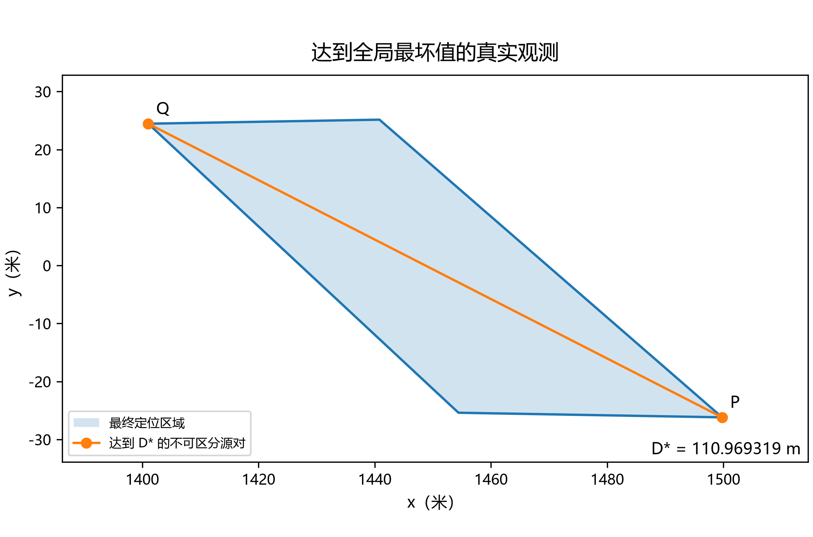{width=12cm}

### 4.4 从标准算例到任意首次观测的策略

记 $\operatorname{Rot}(\theta)$ 为平面旋转矩阵。最终可执行映射为

$$
\boxed{\pi_{\text{±}}(S_1,\widehat\theta_1)=
S_1+\operatorname{Rot}(\widehat\theta_1)S_{\text{*}}^{\text{±}}.} \tag{26}
$$

**命题6（通用保证与策略级全局极小极大）。** 对任意有效首次观测，式(26)保证接收，且精确后验的最坏直径不超过 $D_{\text{*}}$。设 $\Pi$ 为对所有有效首次观测都保证第二次接收或近距返回的全部策略，则

$$
\inf_{\pi\in\Pi}\ \underset{\text{有效首次观测}}{\text{sup}}J(\pi(S_1,\widehat\theta_1))=D_{\text{*}}. \tag{27}
$$

**证明。** 任意首次物理集合在相对坐标中均包含于 $F^0$。式(11)的接收条件对整个 $F^0$ 成立，当然也对其子集成立；相同第二角锥与更小的首次集合相交，只会缩小后验直径，所以式(24)给出所有首次观测的统一上界。另一方面，任何策略在 $S_1=0,\widehat\theta_1=0$ 这一合法观测下都必须选择 $\mathcal C^0$ 中的站位，命题(25)已经证明其代价不能小于 $D_{\text{*}}$。因此任何策略在全部首次观测上的最坏代价至少为 $D_{\text{*}}$；式(26)达到它。证毕。

目标边界截断可能让某个给定首次观测具有比 $D_{\text{*}}$ 更小的逐状态最优值。因此本文严格区分两个结论：未截断状态的站位级精确全局最优，以及包含所有有效首次观测的策略级精确极小极大。没有把对某个边界截断状态的更优可能性当成整体证明缺口，也没有声称每个截断状态的最优点坐标都相同。

### 4.5 连续候选区域

通用接收安全候选区为 $S_1+\operatorname{Rot}(\widehat\theta_1)\mathcal C^0$。进一步，定义

$$
\mathcal C_{20}=\mathcal C^0\cap
\left[(S_{\text{*}}^{\text{+}}+[-4,4]^2)\cup(S_{\text{*}}^{\text{-}}+[-4,4]^2)\right]. \tag{28}
$$

该集合不是有限格点，而是两个8米见方的候选框与安全区的连续交集。对其中的每一点均有 $J(S)\le1.2D_{\text{*}}$。

**证明。** 对上方候选框，站位扰动长度不超过 $h=\sqrt{32}$ 米。五边形内任意源到 $S_{\text{*}}^{\text{+}}$ 的距离至少为 $d_0=(S_{\text{*}}^{\text{+}})_y-b\sin\varepsilon$。移动一个长度不超过 $h$ 的站位，某固定源的方向改变量至多为 $\arcsin(h/d_0)$；这是从源观察扰动圆盘时的切线半角。整数区间证书验证 $d_0\sin0.625^\circ>h$，故任意扰动站位的误差角锥都包含于原最优站位处半宽 $1.625^\circ$ 的同中心方向角锥。将附录A的整区间上界方法应用于这个扩角问题，以56个闭区间覆盖全部方向，得到上界小于 $133.150813$ 米，而 $1.2D_{\text{*}}>133.163182$ 米。镜像区同理。再与 $\mathcal C^0$ 相交保证接收，结论成立。证毕。

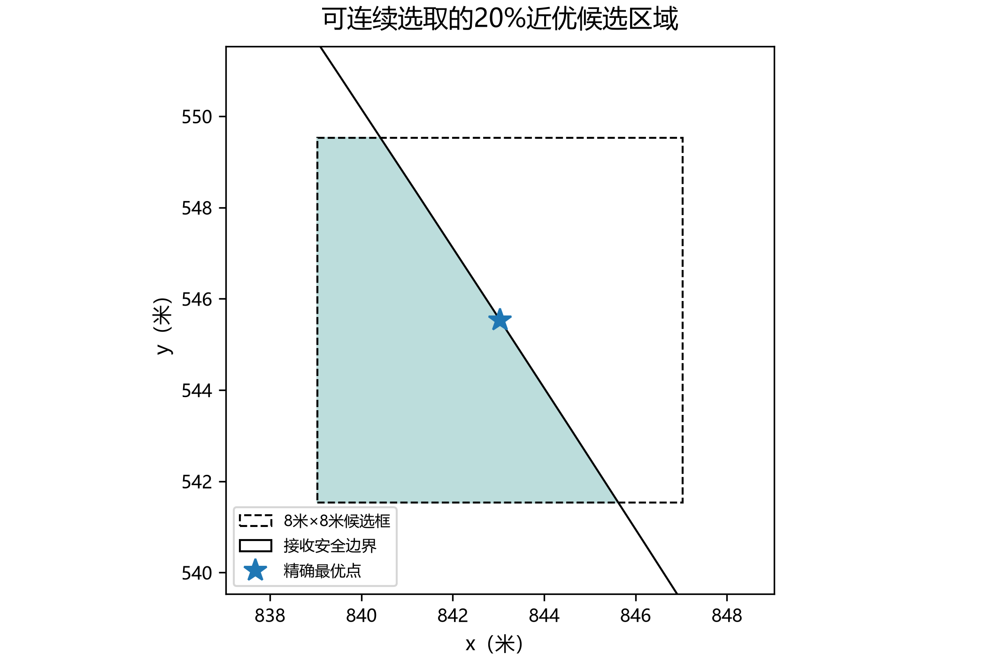{width=10.8cm}

## 5 算法实现、数值保护与复核

第二问运行时不再搜索网格。只需读取原题固定常数，计算一次式(20)和式(18)，以后每次输入做一次旋转和平移，选点时间与源采样数、角度网格数无关，复杂度为 $O(1)$。选点函数没有真实源位置、真实源距或真实接收半径参数。

理论最优点位于一个接收圆的边界上。浮点直接舍入可能把执行坐标放到边界外，因此代码将理想点向严格可行内点 $(750,0)$ 移动 $10^{-7}$ 比例，得到默认执行相对坐标 $(843.034744445260,545.528367886373)$ 米。保护位移约 $0.00005534$ 米。证书同时对执行点的 $10^{-9}$ 米坐标区间验证四个圆约束和完整角度上界，其目标损失上界小于 $0.00000621$ 米。理论精确最优点和执行保护点分别输出，不混用。

全局证书的基础运算采用 $10^{40}$ 为分母的整数区间。加减为精确整数运算，乘除分别向下、向上取整，平方根通过整数平方根夹逼。$\pi$ 由Machin公式的交错级数夹逼，三角函数采用带显式余项的Taylor多项式。多边形裁剪的交点使用精确有理数。二次方程根、根的符号分支、另三个接收圆、活动区间导数、全部其余顶点对和角区间拼接均由独立检查项验证。代码不会在未完成覆盖时输出“证明通过”。

第一问采用平移和尺度化降低大坐标误差；空集、不确定数值状态与零直径区分。最小包围圆以局部随机源组织增量构造，最终显式检查包含性；测试用独立的一点、两点和三点支持圆穷举作为对照。直径圆覆盖判断本身只依赖命题3，不依赖随机最小包围圆算法。

复核命令为 `python run.py prove`、`python run.py test` 和 `python run.py verify`。证书在当前环境通过全部检查；自动化测试共 **158项通过**（由本轮JUnit报告生成）。代码、CSV、图和正文均使用正式共享模块的结果文件。

## 6 数值实验与结果解释

### 6.1 第一问

生成200个共享场景，每个场景依次加入最多12个检测点，在 $n=2,3,5,8,12$ 时评价，总计1000个交会区域。源在目标圆内抽取，检测点允许在目标圆外；各检测距离不超过该场景真实接收半径。位置不同的误差在实验中独立均匀取自 $[-1^\circ,1^\circ]$。所有真实源均被计算区域包含。

| 检测点数 $n$ | 有界 / 总数 | 有界区域直径中位数（米） | 25%—75%分位区间（米） |
|---:|---:|---:|---:|
| 2 | 199/200 | 62.421 | 39.362—128.113 |
| 3 | 200/200 | 32.819 | 20.179—47.445 |
| 5 | 200/200 | 16.066 | 9.484—24.582 |
| 8 | 200/200 | 8.613 | 5.579—13.059 |
| 12 | 200/200 | 5.483 | 3.640—8.468 |

$n=2$ 的一个场景产生无界纯交会区域，程序保留该状态，而非截成有限多边形。表中分位数明确仅针对有界区域；不是删掉观测失败后比较策略。固定同一组观测再添加约束时，交集只会缩小，因而直径不增；跨场景均值和覆盖率则依赖抽样分布，不能当成普适定理。

### 6.2 第二问

在中心、偏心、靠近边界、目标区域外等六类首次站位上共生成1500个有效场景，每个场景给四种策略使用同一真实源、真实接收半径及误差，共6000次评估。场景生成从目标圆均匀源与 $[1000,1500]$ 均匀半径开始，再条件于首次确实收到方向。没有将“先抽半径再在其圆内抽源”误写成另一种条件分布。

| 策略 | 场景数 | 无信号数 | 有效观测直径均值（米） | 有效观测95%分位数（米） |
|:---|---:|---:|---:|---:|
| 极小极大解析策略 | 1500 | 0 | 50.636 | 86.995 |
| 沿示向度前进750米 | 1500 | 0 | 571.274 | 745.251 |
| 垂线方向1000米 | 1500 | 921 | 66.435 | 105.579 |
| Ω内随机点 | 1500 | 879 | 144.671 | 612.014 |

直径列针对有实际后验的观测，无信号数单列且完整保留在CSV中。不能仅根据成功子样本直径评价随机或垂线策略。本文策略在1500次评估中均获得第二次方向，平均后验直径上界为 **50.635792米**，95%分位数为 **86.994676米**。这些是抽样结果；理论保证来自前述证明，不来自“1500次零失败”的外推。

构造式(25)的最坏观测时，$G=1500u_{\text{-}}$、第一次误差为 $+1^\circ$、第二次误差为 $-1^\circ$，真实接收半径取1500米。物理后验内外逼近给出区间 **[110.969243，110.969319]米**，与解析值一致。该算例检验实现，并不是用一次算例替代全域证明。

在全部场景中，以最小包围圆半径不超过20米判断一次光学定位保证，本文策略的对应比例为 **33.7333%**。必须检查 $R_{\text{*}}\le20$；$D\le40$ 并不一般性保证一次光学定位。第二问的两次测向优化与后续精确定位/清除调度也不是同一个任务。

## 7 结论

第一问的输出是可核验的多边形状态、最远顶点对和覆盖判断。最远顶点对定理直接解决连续区域直径；直径圆覆盖一般不成立，其充要条件是最远点对中点圆包含全部顶点。第二问在有界误差和未知接收半径下，给出四圆候选区、解析站位与连续近优候选区域。全域物理下界与覆盖全部观测方向的上界达到同一值，从而得到未截断首次扇形的精确连续全局最优，以及全部有效首次观测上的精确极小极大策略。最终代码不再需要网格搜索来产生该策略。

## 附录A 精确全局上界的完整可执行证明

### A.1 活动区间的全部几何分支

用原相对坐标，令 $\gamma\in\{-\varepsilon,+\varepsilon\}$ 为首次边界角、$\beta$ 为第二边界角。两条边界的交点为

$$
V(\gamma,\beta)=r_\gamma(\beta)u(\gamma),\qquad
r_\gamma(\beta)=\frac{x_{\text{*}}\sin\beta-y_{\text{*}}\cos\beta}{\sin(\beta-\gamma)}. \tag{A1}
$$

其关于弧度的导数为

$$
r'_\gamma(\beta)=\frac{y_{\text{*}}\cos\gamma-x_{\text{*}}\sin\gamma}{\sin^2(\beta-\gamma)}>0. \tag{A2}
$$

在 $I=[-42.1^\circ,-42.0^\circ]$ 定义

$$
A=V(+\varepsilon,\phi-\varepsilon),\quad B=V(-\varepsilon,\phi-\varepsilon),
$$

$$
C=V(+\varepsilon,\phi+\varepsilon),\quad V=V(-\varepsilon,\phi+\varepsilon).
$$

四条测向边界的正向交点均存在。$A,C$ 位于首次上边界，$B,V$ 位于下边界，且对应径向坐标满足 $r_A<r_C$、$r_B<r_V$。两扇形的衰退方向不相交，故交集是以这些点为顶点的有界四边形。在整个区间内 $A,B,C$ 的径向坐标均严格介于5和1500之间；$V$ 则随 $\phi$ 严格向远端移动，并唯一穿过 $p=bu_{\text{-}}$。穿过时刻就是 $\phi_{\text{*}}$。

当 $\phi\le\phi_{\text{*}}$ 时，全部四点都在外圆内，五边形先验不裁掉任何顶点，区域正是 $\operatorname{conv}\{A,B,V,C\}$。除 $AV$ 外，其余五个顶点对在整个 $I$ 上均严格短于 $D_{\text{*}}$，区间检验的最宽上界仍不超过82.543米。令 $r_A=u,r_V=v$，则

$$
\frac12\frac{d}{d\phi}\|A-V\|^2
=u'(u-v\cos\delta)+v'(v-u\cos\delta). \tag{A3}
$$

将式(A1)—(A2)和最优站位的严格区间代入，右侧在整个 $I$ 上被包含于 **[13504.427，41177.230]**，因此严格为正。该分支的最大值只能在 $\phi_{\text{*}}$ 取得，并等于 $D_{\text{*}}^2$。

当 $\phi\ge\phi_{\text{*}}$ 时，$V$ 越过远端切线。该切线与第二上边界的交点落在 $p$ 与 $w=(b,-b\tan(\varepsilon/2))$ 之间；区间检验确认 $w$ 始终在第二上边界之外，所以不会进入下一条远端边。实际交集包含于

$$
\operatorname{conv}\{A,B,C,p,w\}. \tag{A4}
$$

这个凸包除 $Ap$ 以外的九个顶点对，在整个 $I$ 上均严格短于 $D_{\text{*}}$，最宽的上界不超过108.423米。剩余距离满足

$$
\frac12\frac{d}{d\phi}\|A-p\|^2
=u'(u-b\cos\delta)<0, \tag{A5}
$$

因为 $u'>0$ 且 $u<b\cos\delta$。故该分支也在 $\phi_{\text{*}}$ 取得最大值 $D_{\text{*}}^2$。这同时穷尽了活动区间内所有可能的直径顶点对，不能再有漏掉的局部峰值。

### A.2 其余全部方向的闭区间覆盖

对任意闭区间 $[l,h]$，满足 $h-l+2\varepsilon<\pi$ 时，

$$
\bigcup_{\phi\in[l,h]} W(S_{\text{*}},\phi,\varepsilon)
\subseteq W\left(S_{\text{*}},\frac{l+h}{2},\varepsilon+\frac{h-l}{2}\right). \tag{A6}
$$

因此先用扩角扇形裁剪 $P^{\text{+}}$，再求其直径，就得到对该**整个区间**成立的上界。区间较宽时先对半分割；上界尚未低于 $D_{\text{*}}$ 时继续分割。最终得到63个叶区间，连同活动区间 $I$，首尾精确拼接覆盖 $[-180^\circ,180^\circ]$。程序检查最左、最右端点及每一对相邻端点相等，因而不是“采样扫过一圈”的论证。

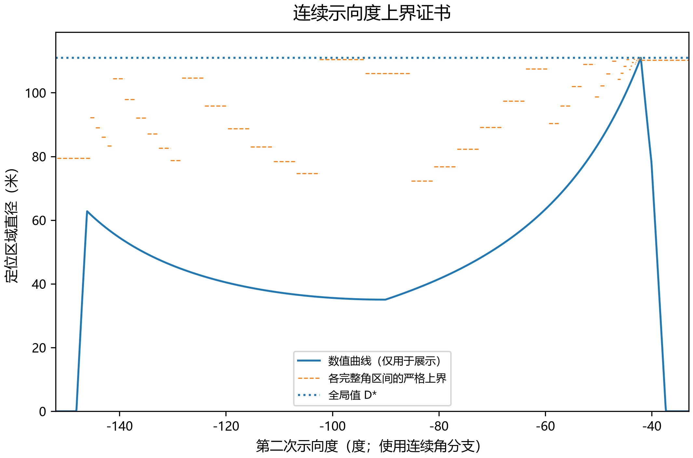{width=12cm}

### A.3 为什么舍入不会破坏证明

设法向量 $n$ 的真实值属于区间 $[n]$，选其有理数中点 $n_0$，误差界为 $\eta_x,\eta_y$。在 $P^{\text{+}}$ 上有 $|x|\le1501,|y|\le27$。于是将真实半平面 $n\cdot g\le n\cdot S_{\text{*}}$ 替换为

$$
n_0\cdot g\le\text{sup}([n]\cdot[S_{\text{*}}])+1501\eta_x+27\eta_y \tag{A7}
$$

只会向外放宽。五边形每个精确顶点也先用包含它的有理数矩形包围，再对这些矩形顶点求凸包，保证初始多边形是外包。

全部裁剪在有理数上执行；每个顶点对距离的平方也是精确有理数。只有当该有理数严格小于 $[D_{\text{*}}^2]$ 的下端点时，才批准该叶区间。因此，即使三角函数、根式或站位坐标还没有被写成无限小数，所有误差都朝安全方向进入证明。

$\pi=16\arctan(1/5)-4\arctan(1/239)$，两项均用交错级数相邻部分和夹逼。正弦、余弦先缩到 $[0,\pi/2]$，使用35项Taylor多项式和显式Lagrange余项；固定点整数乘除总是向区间外取整。这些是验证器本身的算术正确性依据，不是“采用高精度浮点，所以假定误差可忽略”。

活动区间的几何符号验证与其余方向的有理数叶区间合起来证明式(24)。结合物理下界中确实可发生的 $p,q$，证书证明的是精确最优值相等，而不是某个小但非零的最优性间隙。

## 附录B 证明—代码—结果对应表

| 结论 | 数学依据 | 实现及证据 |
|:---|:---|:---|
| 半平面模型与退化状态 | 命题1、式(1) | `geometry.py`；`pure_bearing_region` |
| 连续直径 | 命题2 | 全点对与旋转卡壳独立测试 |
| 直径圆覆盖 | 命题3 | `Region.metrics` 与反例数据 |
| Jung界 | 命题4 | 等边三角形及穷举支持圆测试 |
| 精确物理集合夹逼 | 式(5)—(6) | `posterior.py` |
| 完整未截断接收域 | 命题5 | `safe_centers_local`、四圆约束 |
| 原目标的全域下界 | 式(12)—(21) | `proof.py:lower_checks` |
| 精确全局上界 | 附录A | `active_checks`、`heading_certificate` |
| 全部首次观测的策略保证 | 命题6 | `policy.py` 平移、旋转与镜像 |
| 连续20%候选区 | 式(28) | `candidate_certificate` |
| 执行点数值保护 | 第5节 | `operational_certificate` |
| 图文与数据一致 | 第6节 | 单一JSON/CSV源与交付检查脚本 |

`global_certificate.json` 保留根和坐标的严格区间、所有活动分支的检查值，以及全部角度叶区间。代码不是替代未给出的证明，而是执行本文已经明确列出的有限有理数不等式检查。相反，158项自动化测试和数值实验只说明实现通过了列明的测试，它们不承担上述定理的逻辑证明责任。

## 附录C 补充实验图

下列图片与正文使用同一组正式结果文件。图中的采样曲线不承担全局证明。

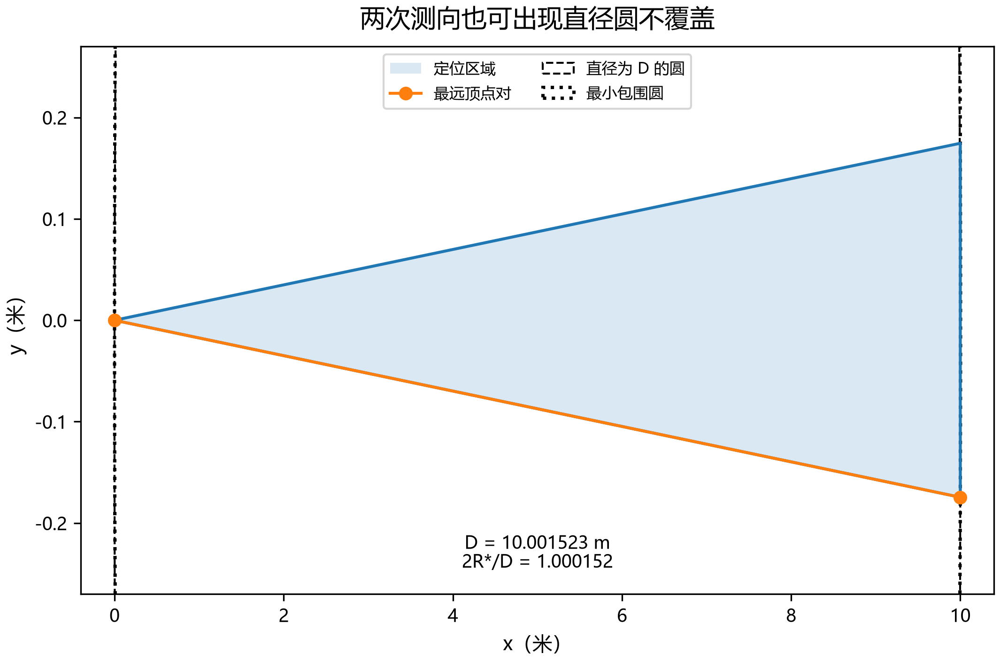{width=11cm}

数据来源：`q1_summary.json:examples.two_station_counterexample`。

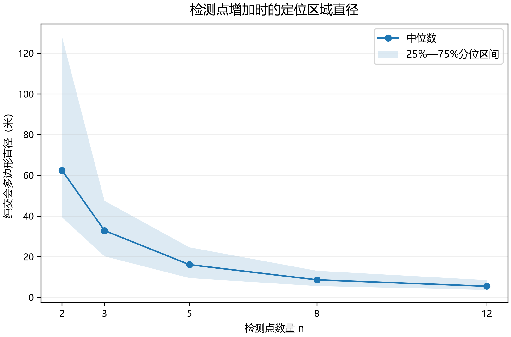{width=11cm}

数据来源：`q1_summary.json:summary`。

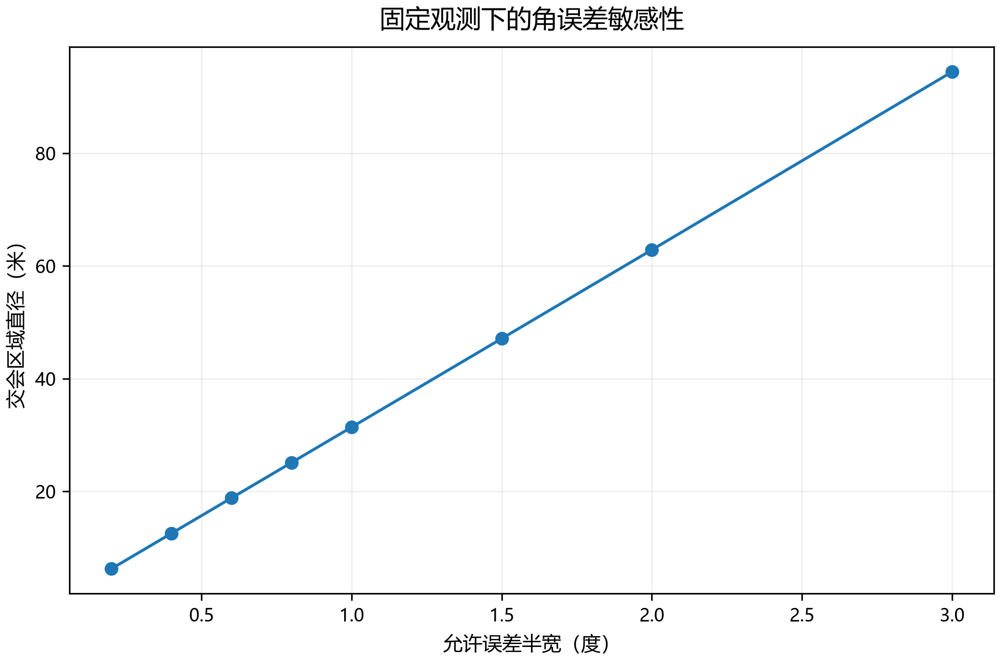{width=11cm}

数据来源：`q1_summary.json:eps_sensitivity`。

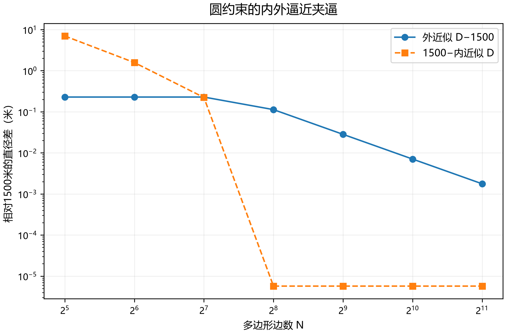{width=11cm}

数据来源：`q1_summary.json:disk_brackets`。

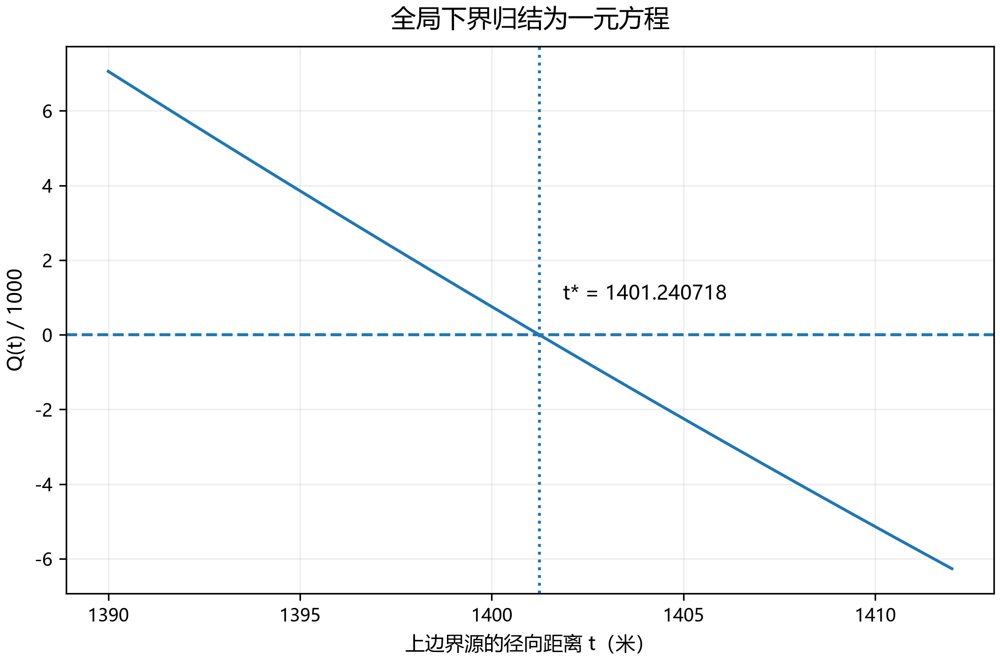{width=11cm}

数据来源：`analytic coefficients; policy constants`。

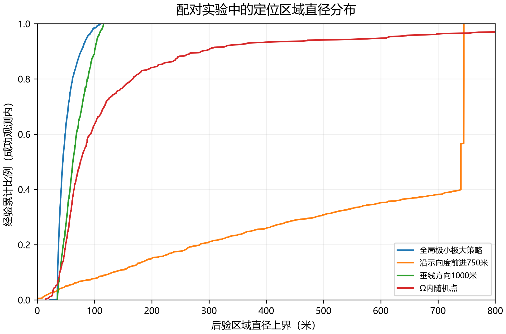{width=11cm}

数据来源：`q2_paired_samples.csv`。

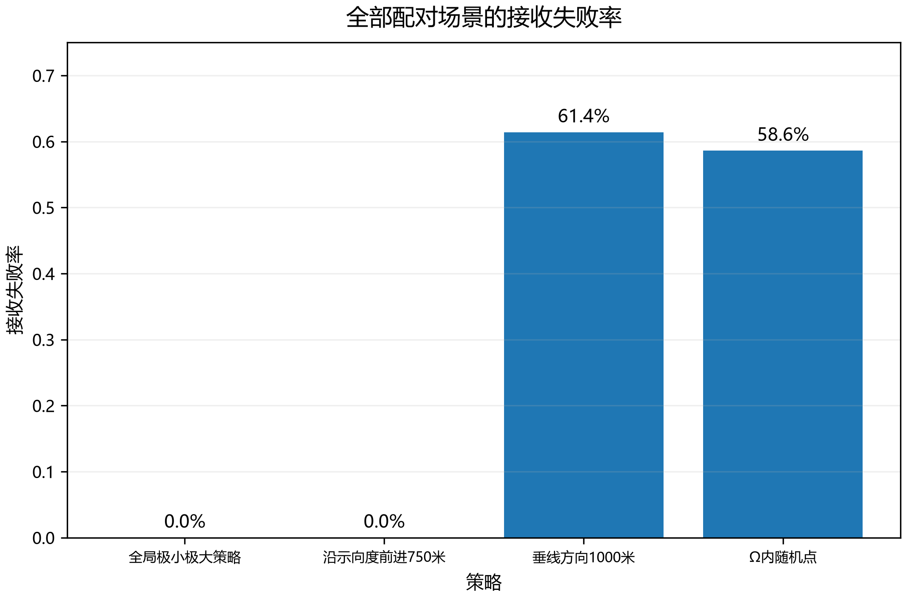{width=11cm}

数据来源：`q2_summary.json:summary`。

## 参考文献

[1] 全国大学生数学建模竞赛组委会. 2026年高教社杯全国大学生数学建模竞赛B题：无线电干扰源的快速自动定位与清除. 2026. 用户提供的原题及附录。

[2] Jung H. Ueber die kleinste Kugel, die eine räumliche Figur einschliesst. Journal für die reine und angewandte Mathematik, 1901, 123: 241–257.
